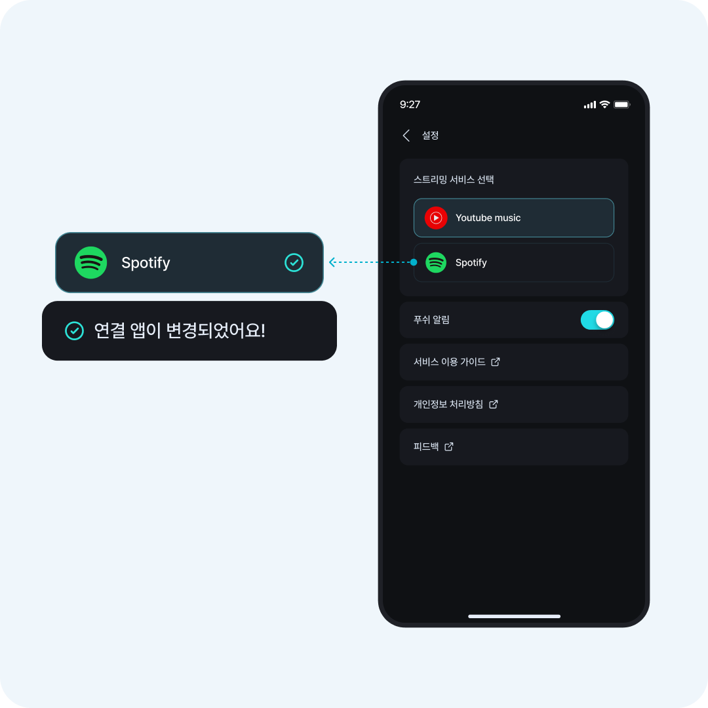
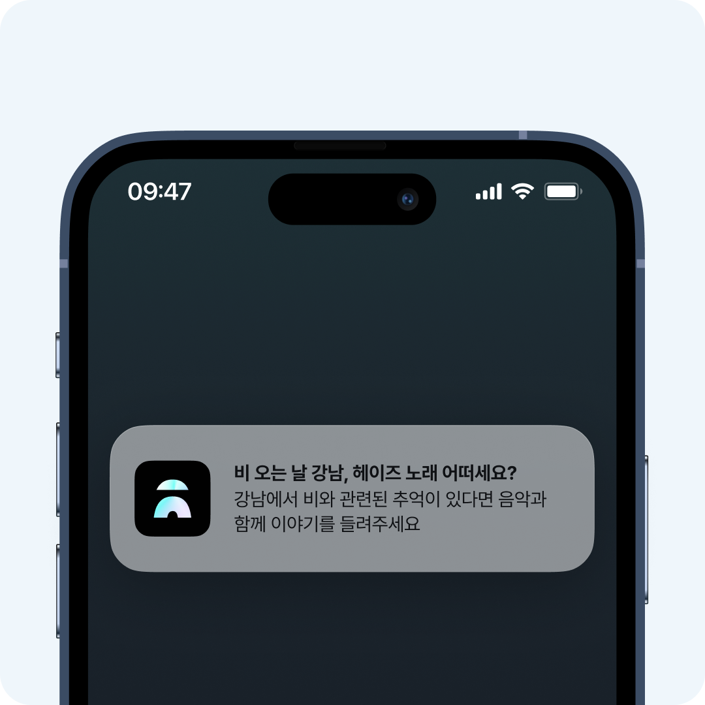

---

### Overview

🎵 **스트릿드랍은 길을 걸으며 음악을 드랍하는 음악 공유 소셜 서비스예요**

석촌호수를 걸으면서 듣는 벛꽂엔딩, 첫 개강 등교길 노래 등 지금 이 거리에서 듣고 있는 노래를 공유하고 싶었던 경험이 있나요?

거리에 코멘트와 함께 노래를 드랍하고, 반경 내 다른 사람이 남긴 음악을 주워 들으며 스트릿드랍의 재미를 느껴보세요!

### 지금 바로 스트릿 드랍을 만나보세요!

<!--truncate-->

## 스트릿 드랍 기능

### 드랍하고 싶은 음악을 검색해 보세요
드랍하고 싶은 음악이 있다면 음악명 또는 가수명을 검색해보세요. 사용자의 위치 정보나 날씨 정보를 토대로 추천 검색어도 큐레이션하고 있어요.

### 음악과 함께 남기고 싶은 말을 코멘트로
코멘트는 5자부터 40자까지 작성할 수 있어요. 드랍하기 버튼을 누르면 음표가 드랍되고, 지도 위에 드랍된 음악을 바로 확인할 수 있어요.

### 드랍된 음악을 듣고 좋아요를 남겨주세요
다른 유저들이 드랍한 음악을 바로 듣기로 들을 수 있어요. 좋아요를 눌러 공감 표현을 하면서 즐겁게 소통할 수 있어요.

### 나의 활동 히스토리와 현재 레벨을 확인해요
드랍과 좋아요 히스토리를 모아보고 관리해요. 현재 레벨을 귀여운 캐릭터와 함께 확인하고, 닉네임 수정과 서비스 관련 설정까지 가능해요.

### 원하는 스트리밍 앱으로 음악을 들어 보세요
유튜브 뮤직와 스포티파이 등 원하는 스트리밍 서비스로 연결할 수 있어요. 드랍한 음악 페이지의 ‘다른 앱으로 듣기’로 바로 설정할 수도 있어요.

### 비 오는 날엔 어떤 노래를 들으시나요?
서비스 이용 정보를 바탕으로 장소 또는 음악을 추천하는 푸시 알림을 전송하고 있어요. 현위치 주변의 실시간 드랍 개수 정보도 전송해 호기심을 자극해요.

