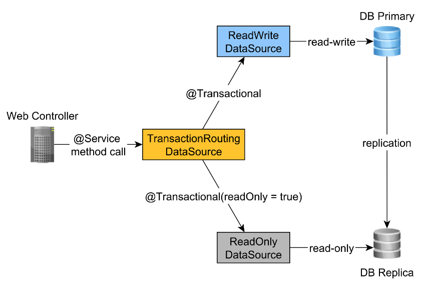

안녕하세요. 스트릿 드랍에서 백엔드 개발을 하고 있는 윤 영(Yun Young)이라고 합니다.

이번 포스팅에서는 스프링의 @Transactional 애노테이션의 적절한 사용 방법에 대해 좋은 글이 있어서 해당 글을 번역하고 추가적인 설명을 작성해보았습니다. 

해당 포스팅에서 참조한 [원문]은 여기를 참조하실 수 있습니다.

우선 Spring에서 사용하는 `@Transaction` 에 대해 알아보겠습니다.


### @Transactional 
`@Transactional`은 스프링에서 제공하는 애노테이션으로, 트랜잭션 경계를 정의하는데 사용됩니다.
트랜잭션은 여러 데이터베이스 연산을 한 단위로 묶어, 모든 연산이 성공적으로 완료되거나 아무것도 실행되지 않도록 하는 것 (All or Nothing)을 의미합니다.

스프링은 1.0 버전부터 개발자가 트랜잭션 경계를 선언적으로 정의할 수 있도록 AOP 기반의 트랜잭션 관리를 지원했습니다.

그 직후 1.2 버전에서 Spring은 @Transactional 애노테이션을 지원하여 비즈니스 작업 단위의 트랜잭션 경계를 더욱 쉽게 설정할 수 있게 되었습니다.

@Transaction 애노테이션은 다음과 같은 속성을 제공합니다.

- **value and transactionManager**: 애노테이션이 붙은 블록의 트랜잭션을 처리할 때 사용될 TransactionManager 참조를 제공하는데 사용됩니다.

- **propagation**: 트랜잭션 경계가 애노테이션이 붙은 블록 내에서 직접 또는 간접적으로 호출되는 다른 메서드로 전파되는 방법을 정의합니다. 
기본은 `REQUIRED`이며 트랜잭션이 이미 사용 가능하지 않은 경우 트랜잭션이 시작됨을 의미합니다. 그렇지 않으면 현재 실행 중인 트랜잭션이 사용됩니다.

- **timeout and timeoutString**: TransactionTimedOutException을 발생시키기 전에 현재 메서드를 실행할 수 있는 최대 시간(초)을 정의합니다.

- **readOnly**: 현재 트랜잭션이 읽기 전용인지 읽기/쓰기인지를 정의합니다.

- **rollbackFor and rollbackForClassName**: 현재 트랜잭션이 롤백될 하나 이상의 Throwable 클래스를 정의합니다. 기본적으로 트랜잭션은 RuntimeException 또는 Error가 발생한 경우 
롤백되지만 checkedException이 발생한 경우에는 롤백되지 않습니다.

- **noRollbackFor and noRollbackForClassName**: 현재 트랜잭션이 롤백되지 않을 하나 이상의 Throwable 클래스를 정의 합니다. 


### @Transactional의 동작 원리
스프링의 @Transactional은 `AOP(Aspect-Oriented Programming)` 기반으로 동작합니다.
@Transactional이 선언된 메서드가 호출되면, 스프링은 해당 메서드를 `프록시(Proxy)`로 감싸 해당 트랜잭션의 경계를 설정합니다.
메서드의 실행 전에 트랜잭션을 시작하고, 메서드 실행 후에 트랜잭션을 커밋하거나 롤백합니다. 이때, 런타임 예외가 발생하면 트랜잭션은 롤백 됩니다.


### @Transactional은 어떤 계층에 속할까?
@Transactional 트랜잭션 경계를 정의하는 것은 `서비스 계층(Service layer)`의 책임이므로 @Transactional 애노테이션은 서비스 계층에 속합니다.
`웹 계층(Presentation layer)`에서는 사용하지 말아야 합니다. 이렇게 하면 데이터베이스 트랜잭션 응답 시간이 증가하고, 데이터베이스 트랜잭션 오류(예: 일관성, 교착 상태, 잠금 획득, 낙관적 잠금)에 대해 올바른 오류 메시지를 제공하기가 더 어려워질 수 있기 때문입니다.
`DAO(Data Access Object) 또는 Repository 계층`은 애플리케이션 수준의 트랜잭션을 필요로 하지만 이 트랜잭션은 서비스 계층에서 전파되어야 합니다.


### @Transactional의 적절한 위치
- 클래스 레벨에서의 선언
  - 해당 클래스의 모든 public 메서드에 트랜잭션 처리가 적용됩니다.
  - 클래스의 모든 메서드에 동일한 트랜잭션 속성을 적용할 때 유용합니다.
- 메서드 레벨에서의 선언
  - 해당 메서드에서만 트랜잭션 처리가 적용됩니다.
  - 클래스 내에서 특정 메서드에만 트랜잭션을 적용하거나 메서드마다 다른 트랜잭션 속성을 적용하고자 할 때 유용합니다.
  

### @Transactional을 사용하는 가장 좋은 방법
서비스 계층에서는 `데이터베이스 관련(database-related)` 서비스와 `비데이터베이스(non-database-related)` 관련 서비스 모두를 포함할 수 있습니다.
주어진 비즈니스 사용 사례가 둘을 혼합해야 할 경우, 예를 들어 주어진 문장을 파싱하거나 보고서를 작성하고 데이터베이스에 일부 결과를 저장해야 하는 경우, 데이터베이스 트랜잭션이 **가능한 늦게 시작되는 것**이 좋습니다.

이러한 이유로, 다음과 같은 `RevolutStatementService`와 같은 비트랜잭션(non-transactional)인 게이트웨이 서비스를 가질 수 있습니다.

```java
@Service
public class RevolutStatementService {
 
    @Transactional(propagation = Propagation.NEVER)  // 1
    public TradeGainReport processRevolutStocksStatement(
            MultipartFile inputFile,
            ReportGenerationSettings reportGenerationSettings) {
        return processRevolutStatement(
            inputFile,
            reportGenerationSettings,
            stocksStatementParser
        );
    }
     
    private TradeGainReport processRevolutStatement(
            MultipartFile inputFile,
            ReportGenerationSettings reportGenerationSettings,
            StatementParser statementParser
    ) {
        ReportType reportType = reportGenerationSettings.getReportType();
        String statementFileName = inputFile.getOriginalFilename();
        long statementFileSize = inputFile.getSize();
 
        StatementOperationModel statementModel = statementParser.parse(  // 1-1
            inputFile,
            reportGenerationSettings.getFxCurrency()
        );
        int statementChecksum = statementModel.getStatementChecksum();
        TradeGainReport report = generateReport(statementModel);  // 1-2
 
        if(!operationService.addStatementReportOperation(  // 2
            statementFileName,
            statementFileSize,
            statementChecksum,
            reportType.toOperationType()
        )) {
            triggerInsufficientCreditsFailure(report);
        }
 
        return report;
    }
}
```

1. `processRevolutStocksStatement` 메서드는 트랜잭션을 처리하지 않으며, 따라서 이 메서드가 활성 트랜잭션에서 호출되지 않도록 `Propagation.NEVER`전략을 사용할 수 있습니다.
- 따라서 `statementParser.parse()` 메서드 및 `generateReport()` 메서드는 데이터베이스 연결이 필요 없고, 단순히 application-level의 처리만을 원하기 때문에 넌-트랜잭션 컨텍스트에서 실행됩니다.

2. `operationService.addStatementReportOperation`만 트랜잭션 컨텍스트에서 실행해야 합니다. 이러한 이유로 `addSatementReportOperation`은 @Transactional 애노테이션을 사용합니다.
   `addSatementReportOperation`이 기본 격리 수준을 재정의하고 SERIALIZABLE 데이터베이스 트랜잭션에서 이 메서드를 실행한다는 것에 유의해야 합니다.

```java
@Service
@Transactional(readOnly = true)
public class OperationService {
 
    @Transactional(isolation = Isolation.SERIALIZABLE)
    public boolean addStatementReportOperation(
        String statementFileName,
        long statementFileSize,
        int statementChecksum,
        OperationType reportType) {
		
    }
}
```

또다른 주목할만한 사항은 클래스가 `@Transactional(readOnly = true)`로 애노테이션이 달려 있어서 기본적으로 모든 서비스 메서드는 이 설정을 사용하고 메서드가 자체 정의를 사용하여
트랜잭션 설정을 재정의하지 않는 한 읽기 전용 트랜잭션에서 실행됩니다.
트랜잭션 서비스의 경우 클래스에서 readOnly 속성을 true로 설정하고, 데이터베이스의 쓰기의 사용이 필요한 서비스 메서드에서 트랜잭션을 오버라이딩해서 사용하는 것이 좋습니다.

예를 들어 UserServicesms 동일한 패턴을 사용합니다.
```java
@Service
@Transactional(readOnly = true)
public class UserService implements UserDetailsService {
 
    @Override
    public UserDetails loadUserByUsername(String username)
        throws UsernameNotFoundException {
    }
     
    @Transactional
    public void createUser(User user) {
    }
}
```

`loadUserByname`은 읽기 전용 트랜잭션을 사용하며, Hibernate를 사용하고 있기 때문에 Spring은 읽기 전용 최적화를 수행합니다.
반면 `createUser`는 데이터베이스에 기록해야 합니다.
따라서 @Transactional 애노테이션에서 제공하는 기본 설정인 readOnly = false로 readOnly 속성값을 재정의하여 트랜잭션을 읽기-쓰기로 만듭니다.

읽기-쓰기와 읽기 전용 메서드를 분리하는 또 다른 큰 이점은 [이 문서]에서 설형한 대로 다른 데이터베이스 노드로 라우팅할 수 있다는 것입니다.
이렇게 하면 복제 노드의 수를 늘려 읽기 전용 트래픽을 확장할 수 있습니다. 



### 결론
마지막으로 스프링의 `@Transactional` 애노테이션을 효율적으로 사용하기 위한 몇 가지 최적화 방법을 살펴보겠습니다.

#### 1. 적절한 위치에 선언하기 
@Transactional은 주로 서비스 계층에서 사용됩니다. DAO 또는 Repository 계층에서는 트랜잭션을 시작하지 않는 것이 일반적입니다.
컨트롤러 계층에서는 사용하지 않는 것이 좋습니다. 

#### 2. readOnly 속성 사용  
데이터베이스에서 데이터만 읽을 때는 'readOnly = true' 속성을 사용하여 트랜잭션을 최적화할 수 있습니다. 이를 통해 불필요한 데이터베이스 write lock을 피할 수 있습니다.

#### 3. 명시적인 트랜잭션 전파 정의  
'propagation' 속성을 사용하여 트랜잭션의 전파 방식을 명시적으로 정의할 수 있습니다. 예를 들어, 상위 트랜잭션 내부에서 메서드를 호출할 때 새로운 트랜잭션을 시작하려면 `Propagation.REQUIRES_NEW`를 사용하세요.

#### 4. 예외 처리에 따른 롤백 정의  
`rollbackFor` 및 `noRollbackFor` 속성을 사용하여 특정 예외가 발생했을 때 트랜잭션을 롤백할지 여부를 정의할 수 있습니다. 

#### 5. 클래스 레벨과 메서드 레벨 애노테이션 사용 
클래스 레벨에 @Transactional 을 선언하면 해당 클래스의 모든 메서드에 트랜잭션 관리가 적용됩니다. 하지만 일부 메서드에 대한 트랜잭션 설정을 재정의하려면 해당 메서드에 @Transactional 을 재선언하면 됩니다.

#### 6. 트랜잭션 격리 수준 정의 
`isolation` 속성을 사용하여 트랜잭션의 격리 수준을 정의할 수 있습니다. 이를 통해 특정 트랜잭션 내에서 다른 트랜잭션에서 수행하는 작업의 가시성을 조정할 수 있습니다.

#### 7. 트랜잭션 타임아웃 설정 
`timeout` 속성을 사용하여 트랜잭션이 지정된 시간 이내에 완료되지 않을 경우 롤백되도록 설정할 수 있습니다.

#### 8. 여러 트랜잭션 관리자 사용
`transactionManager` 속성을 사용하여 여러 데이터 소스를 가진 애플리케이션에서 특정 트랜잭션 관리자를 지정할 수 있습니다.

위의 방법들을 통해 Spring의 @Transactional 애노테이션을 더 효율적으로 사용하여 애플리케이션의 트랜잭션 관리를 최적화할 수 있습니다. 

[원문]: https://vladmihalcea.com/spring-transactional-annotation/
[이 문서]: https://vladmihalcea.com/read-write-read-only-transaction-routing-spring/
