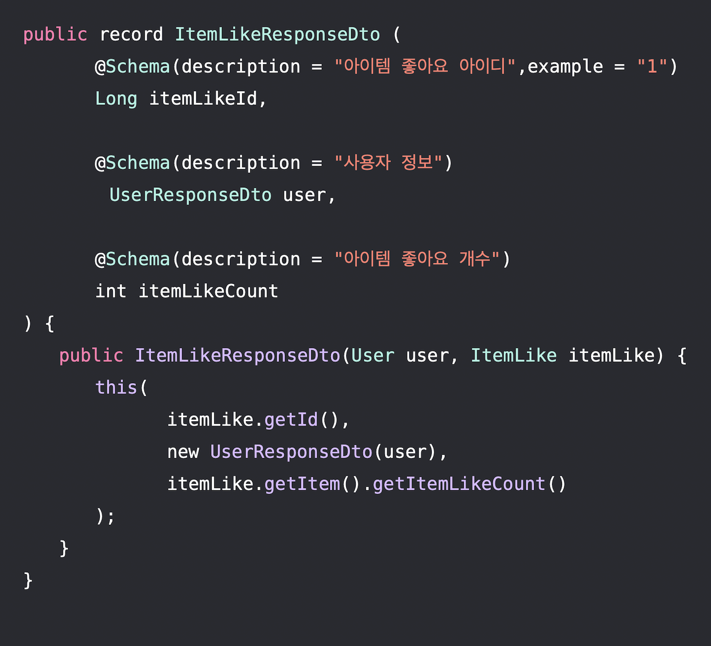

안녕하세요. 스트릿 드랍에서 백엔드 개발을 하고 있는 윤 영(Yun Young) 입니다.

Java는 지속적으로 발전하면서 개발자들에게 더 나은 프로그래밍 경험을 제공하려고 노력합니다.
Java 14에서 프리뷰 기능으로 도입된 'Record'는 그러한 노력의 한 예 입니다.

스트릿 드랍(Street Drop)을 개발할 때 Response DTO를 Java의 Record 타입으로 사용했는데요.

이번 포스팅에서는 Java의 'Record'에 대한 개념과 그 사용 이유를 알아보도록 하겠습니다. 

### Record란?
Java에서의 **'Record'**는 데이터만을 포함하는 불변(immutable)한 객체를 간단하게 정의할 수 있게 도와주는 
새로운 타입입니다.

기존의 Java에서 데이터 전용 클래스를 정의하기 위해서는 많은 보일러 플레이트(자동 생성된 코드)가 필요했습니다.
생성자, Getter, eqauls(), hashCode(), toString() 등 다양한 메소드가 필요했습니다.

Record는 이런 불편함을 해소해주며, 간결한 문법으로 데이터를 표현할 수 있게 해줍니다.

스트릿 드랍에서는 음악 아이템에 대해 좋아요를 눌렀을 때 요청을 처리하고 ItemLikeResponseDto를 반환합니다.

Record 타입으로 응답 DTO 클래스를 정의함으로써 코드가 한껏 간결해진 것을 볼 수 있습니다.

### Record의 특성
1. **불변성**: Record의 모든 필드는 불변(immutable) 입니다. 따라서 한번 생성되면 그 값을 변경할 수 없습니다.
2. **표준 메서드 자동 제공**: equals(), hashCode(), toString()과 같은 메서드가 자동으로 제공됩니다.
3. **제한된 상속**: Record는 다른 클래스를 상속받을 수 없으며, 상속되도록 할 수 없습니다.

### 왜 Record를 사용했는가?
1. **간결성**: DTO와 같은 데이터 전용 클래스를 정의할 때 필요한 보일러플레이트 코드를 줄일 수 있습니다.
2. **명확한 의도**: Record를 사용함으로써 해당 클래스가 데이터 전용임을 명확히 나타낼 수 있습니다.
3. **불변성 보장**: Record는 데이터의 불변성을 보장함으로써 버그 발생을 최소화하고 코드의 안정성을 향상시킵니다.

### 결론
Java의 Record는 데이터 전용 클래스의 정의를 간결하게 만들어주면서도 코드의 안정성과 명확성을 보장합니다.

데이터를 표현하는 객체에서 많은 보일러플레이트 코드를 줄이고, 불변성을 갖는 객체를 정의할 땐 'Record'를 사용하는 것을
고려해보세요.
