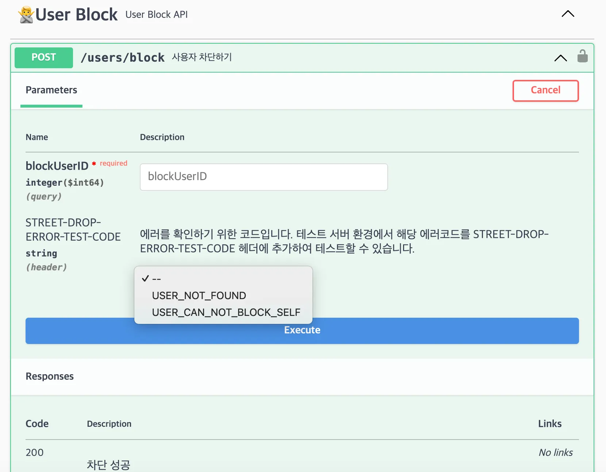

안녕하세요. 스트릿 드랍에서 백엔드 개발을 하고 있는 정성훈이라고 합니다.

이번 포스팅에서는 스트릿 드랍에서 에러를 처리하면서, 특정 인터페이스를 구현한 클래스를 찾는 방식에 대해서 고민했던 과정을 공유드리려고 합니다.

## 스트릿 드랍의 에러처리 방식
스트릿 드랍에서는 에러코드를 도메인 별로 분리하여, 처리하고 있습니다.

``` java
@Getter
@AllArgsConstructor
public enum CommonErrorCode implements ErrorCodeInterface {
    /*
     * Basic Client Error
     */
    BAD_REQUEST(HttpStatus.BAD_REQUEST, "COMMON_BAD_REQUEST", "Bad Request", "The request could not be understood or was missing required parameters."),
    METHOD_ARGUMENT_NOT_VALID(HttpStatus.BAD_REQUEST, "COMMON_METHOD_ARGUMENT_NOT_VALID", "Method Argument Not Valid", "One or more method arguments are not valid."),
    UNAUTHORIZED(HttpStatus.UNAUTHORIZED, "COMMON_UNAUTHORIZED", "Unauthenticated", "Authentication is required and has failed or has not been provided."),
    FORBIDDEN(HttpStatus.FORBIDDEN, "COMMON_FORBIDDEN", "Forbidden", "Access to the requested resource is forbidden."),
    NOT_FOUND(HttpStatus.NOT_FOUND, "COMMON_NOT_FOUND", "Not Found", "The requested resource could not be found."),
    METHOD_NOT_ALLOWED(HttpStatus.METHOD_NOT_ALLOWED, "COMMON_METHOD_NOT_ALLOWED", "Method Not Allowed", "The method received in the request-line is known by the origin server but not supported."),
    CONFLICT(HttpStatus.CONFLICT, "COMMON_CONFLICT", "Conflict", "The request could not be completed due to a conflict with the current state of the target resource."),

    /*
     * Basic Server Error
     */
    INTERNAL_SERVER_ERROR(HttpStatus.INTERNAL_SERVER_ERROR, "COMMON_INTERNAL_SERVER_ERROR", "Internal Server Error", "An unexpected error occurred"),
    NOT_IMPLEMENTED(HttpStatus.NOT_IMPLEMENTED, "COMMON_INTERNAL_SERVER_ERROR", "Not Implemented", "The server does not support the functionality required to fulfill the request.");


    private final HttpStatus status;
    private final String errorResponseCode;
    private final String title;
    private final String message;

    @Override
    public ErrorCode toErrorCode() {
       return ErrorCode
             .builder()
             .status(status)
             .errorResponseCode(errorResponseCode)
             .title(title)
             .message(message)
             .build();
    }
}
```

``` java
@Getter
@AllArgsConstructor
public enum ItemErrorCode implements ErrorCodeInterface {
    ITEM_NOT_FOUND(HttpStatus.NOT_FOUND, "ITEM_NOT_FOUND", "Item Not Found", "Item Not Found"),
    ITEM_ALREADY_LIKED(HttpStatus.CONFLICT, "ITEM_ALREADY_LIKED", "Item Already Liked", "User already item liked"),
    ITEM_ALREADY_REPORTED(HttpStatus.CONFLICT, " ITEM_ALREADY_REPORTED", "Item Already Reported", "User already item reported");

    private final HttpStatus status;
    private final String errorResponseCode;
    private final String title;
    private final String message;


    @Override
    public ErrorCode toErrorCode() {
        return ErrorCode
                .builder()
                .status(status)
                .errorResponseCode(errorResponseCode)
                .title(title)
                .message(message)
                .build();
    }
}
```

위의 예와 같이, CommonErrorCode와 ItemErrorCode에 ErrorCodeInterface를 통해서 Enum에 상태값, 에러제목, 에러 메세지를 형식을 포함하도록 강제하고 있습니다.

``` java
private final HttpStatus status; // HTTP 상태 코드
private final String errorResponseCode; // 에러 응답 코드
private final String title; // 에러 메세지 제목
private final String message; // 에러 메세지 내용
```

아래는 디프만에서 같이 활동했던, 찬진님의 에러코드를 분리하는 블로그글인데 참고하셔도 좋을 것 같습니다.
> [**[스프링] error code 도메인 별 분리하기**](https://devnm.tistory.com/27)
> 
> 두둥 프로젝트에서는 처리중에 에러가 발생할경우 RuntimeException 을 상속받은 DuDoongException 에서 다시 상속받아서 코드별 에러클래스를 만들고 있다. @Getter…
> 
> [https://devnm.tistory.com/27](https://devnm.tistory.com/27)

## 커스텀 헤더를 통한 errorResponseCode 기반의 시나리오 테스트

스트릿 드랍에서는 커스텀 헤더를 통해서 개발 환경에서 클라이언트가 에러 시나리오를 보다 쉽게 테스트할 수 있도록 제공하고 있습니다. 위의 errorResponseCode를 추가하여 테스트할 수 있도록 구성하였습니다.


```
STREET-DROP-ERROR-TEST-CODE: USER_NOT_FOUND
```

토스에서 사용하는 HTTP 헤더로 에러 시나리오를 테스트 하는 방법인데 참고하셔도 좋을 것 같습니다.
> [**HTTP 헤더로 에러 테스트하기**](https://velog.io/@tosspayments/HTTP-헤더로-에러-테스트하기-zuya4t6v)
>
> 토스페이먼츠 API를 사용해서 커스텀 HTTP 헤더로 다양한 에러 시나리오를 테스트하세요. 개발 과정에서 예상치 못한 문제를 미리 발견하고 대응할 수 있...
>
> [https://velog.io/@tosspayments/HTTP-헤더로-에러-테스트하기-zuya4t6v](https://velog.io/@tosspayments/HTTP-헤더로-에러-테스트하기-zuya4t6v)





스프링 필터를 통해서 구현하였고 개발과 로컬 환경에서 작업이 가능하며, 에러 테스트 헤더가 들어오면, 적합한 에러 ErrorCode Enum을 가져와서 적합한 에러를 반환합니다.


``` java
@Profile({"dev", "local"})
@Component
@Slf4j
public class ErrorTestHeaderFilter extends OncePerRequestFilter {

    public static final String ERROR_TEST_HEADER = "STREET-DROP-ERROR-TEST-CODE";
    private final ObjectMapper objectMapper = new ObjectMapper().registerModule(new JavaTimeModule()).disable(SerializationFeature.WRITE_DATES_AS_TIMESTAMPS);

    @Override
    protected void doFilterInternal(HttpServletRequest request, @NotNull HttpServletResponse response, @NotNull FilterChain filterChain) throws ServletException, IOException {
        String errorTestHeader = request.getHeader(ERROR_TEST_HEADER);

        if (errorTestHeader != null) {
            Optional<ErrorCode> errorCode = ErrorCodeMapper.findByErrorCode(errorTestHeader); // 에러코드를 찾는 부분

            if (errorCode.isPresent()) {
                throwErrorResponse(response, errorCode.get());
                return;
            }
        }
        filterChain.doFilter(request, response);
    }

    private <T extends ErrorCodeInterface> void throwErrorResponse(HttpServletResponse response, T errorCode) throws IOException {
        response.setContentType(APPLICATION_JSON_VALUE);
        response.setStatus(errorCode.getStatus().value());

        HttpErrorResponseDto httpErrorResponseDto = HttpErrorResponseDto.from(errorCode);
        String errorResponseJson = objectMapper.writeValueAsString(httpErrorResponseDto);

        response.getWriter().write(errorResponseJson);
    }

}
```

## 여러 enum에서 맞는 errorResponseCode 찾기
도메인별로 에러코드를 Enum으로 다르게 구분하였기 때문에, 에러처리 필터에서, errorResponseCode를 가지고 도메인별로 흩어져있는 enum에서 맞는 errorResponseCode를 찾아야 합니다.(
`ErrorCodeMapper.findByErrorCode(errorTestHeader)` 에서 이 과정을 처리하고 있습니다.)
만약, HELLLO_BAD_REQUEST 라는 errorResponseCode가 들어오면 아래와 같이 여러 패키지에 있는 ErrorCode의 errorResposeCode에서 맞는 값을 찾아주어야 합니다.

``` java
@Getter
@AllArgsConstructor
public enum HelloErrorCode implements ErrorCodeInterface {
    BAD_REQUEST_HELLO(HttpStatus.BAD_REQUEST, "HELLLO_BAD_REQUEST", "Bad Request", "The request could not be understood or was missing required parameters.");
}
```

``` java
@Getter
@AllArgsConstructor
public enum NiceErrorCode implements ErrorCodeInterface {
    BAD_REQUEST_NICE(HttpStatus.BAD_REQUEST, "NICE_BAD_REQUEST", "Bad Request", "The request could not be understood or was missing required parameters.");
}
```

이를 위해서는 특정 Interface를 구현한 Enum을 찾아서, 모든 Enum에서 errorResponse와 맞는 값을 찾는 과정이 필요합니다. 값을 찾기 위해서는 크게 두가지 방법이 있습니다.
1. QueryDSL이나 Lombok과 같이 컴파일 시점에서 도메인 별로 흩어져 있는 Enum 값들 하나로 모은 StreetDropErrorCode를 파일로 만들어 이를 참고하는 방식 (QType과 같은 방식으로 처리)
2. 실행시점에서 특정 인터페이스를 구현한 클래스를 찾아서 해당 클래스에서 맞는 errorResponse 코드를 찾는 방식

커스텀 헤더를 통한 errorResponseCode 기반의 시나리오 테스트가 개발환경에서만 제공되기 때문에 크게 성능에 대해서 민감하지 않으며, 1번의 경우 복잡성이 올라갈 것으로 예상해 실행시점에서 특정
인터페이스를 구현한 클래스를 찾는 방식을 선택해 구현하였습니다.

## 특정 인터페이스를 구현한 클래스를 찾기
특정 인터페이스를 구현한 클래스를 찾는 방법은 크게 3가지가 있습니다.
1. Service Loader를 사용
2. Reflection을 통한 접근
3. 스프링의 ClassPathScanningCandidateComponentProvider를 통한 접근

### Service Loader의 사용
Service Loader는 자바에서 제공하는 기능으로, 특정 인터페이스를 구현한 클래스를 동적으로 찾아내고 로드할 수 있도록 도와주는 메커니즘입니다. 이는 Java6부터 도입되었으며, 자바의 모듈 시스템이 도입되기
전에 서비스 제공자를 찾기 위해 주로 사용되었습니다.
``` java
public interface ErrorCodeInterface {
}
```

``` java
public enum HelloErrorCode implements ErrorCodeInterface {
    BAD_REQUEST_HELLO(HttpStatus.BAD_REQUEST, "HELLLO_BAD_REQUEST", "Bad Request", "The request could not be understood or was missing required parameters.");
}
```

``` java
public enum NiceErrorCode implements ErrorCodeInterface {
    BAD_REQUEST_NICE(HttpStatus.BAD_REQUEST, "NICE_BAD_REQUEST", "Bad Request", "The request could not be understood or was missing required parameters.");
}
```

위와 같이 ErrorCodeInterface와 이를 구현한 HelloErrorCode와 NiceErrorCode가 있으면
```
META-INF/services/com.streetdrop.error.dto.interfaces.ErrorCodeInterface
```
파일을 생성하고, 해당 파일안에 구현 클래스인 HelloErrorCode와 NiceErrorCode의 classpath를 작성해줍니다.

```
# META-INF/services/com.streetdrop.error.dto.interfaces.ErrorCodeInterface
com.streetdrop.hello.error.dto.HelloErrorCode;
com.streetdrop.nice.error.dto.NiceErrorCode;
```

코드에서는 다음과 같이 서비스를 로드하여 사용할 수 있습니다.
```
private List<StreetDropErrorCode> createStreetDropErrorCodeList() {
        ServiceLoader<ErrorCodeInterface> errorCodeInterfaces = ServiceLoader.load(ErrorCodeInterface.class);
        for (ErrorCodeInterface errorCodeInterface : errorCodeInterfaces) {
            var errorResponseCode = errorCodeInterface.getErrorResponseCode();
            var error = errorCodeInterface.toErrorCode();
            var streetDropError = new StreetDropErrorCode(errorResponseCode, error);
            streetDropErrorCodeList.add(streetDropError);
        }
}
```

### Reflection을 통한 접근

이전에 자바와 Reflection과 관련한 글입니다.
> [**[Spring] Unit테스트간 Reflection을 활용하여 접근 제어필드 값 변경하기**](https://dev-seonghun.medium.com/unit테스트간-reflection을-활용하여-접근-제어필드-값-변경하기-5c68766b1c35)
>
> 스프링에서 Unit 테스트를 작성하다 보면, Private, Protected 등 접근제어자가 설정된 필드에 값을 넣어주어야 하는 경우가 발생하는데, 이때 접근 제어자...
> 
> [https://dev-seonghun.medium.com/unit테스트간-reflection을-활용하여-접근-제어필드-값-변경하기-5c68766b1c35](https://dev-seonghun.medium.com/unit테스트간-reflection을-활용하여-접근-제어필드-값-변경하기-5c68766b1c35)


Reflection을 통해서, JVM 상의 클래스 정보를 바탕으로 특정 인터페이스를 구현한 클래스를 찾을 수 있습니다.
```
dependencies {
    implementation 'org.reflections:reflections:0.10.2'
}
```
getSubTypesOf 메서드를 사용하면 특정 타입의 하위 타입을 모두 가져올 수 있습니다.
```
public <T> Set<Class<? extends T>> getSubTypesOf(Class<T> type)
```

다음과 같이 하위 타입을 모두 가져와 Enum인지 가져와서 사용할 수 있습니다.
``` java
private List<StreetDropErrorCode> createStreetDropErrorCodeList() {
    List<StreetDropErrorCode> streetDropErrorCodeList = new ArrayList<>();
    Set<Class<? extends ErrorCodeInterface>> list = new Reflections().getSubTypesOf(ErrorCodeInterface.class);
    for (Class<? extends ErrorCodeInterface> errorCodes : list) {
        if (errorCodes.isEnum()){
            for (var errorCode : errorCodes.getEnumConstants()) {
                if (errorCode != null){
                    var errorResponseCode = errorCode.getErrorResponseCode();
                    var error = errorCode.toErrorCode();
                    var streetDropError = new StreetDropErrorCode(errorResponseCode, error);
                    streetDropErrorCodeList.add(streetDropError);
                }
            }
        }

    }

    return streetDropErrorCodeList;
}

```

### ClassPathScanningCandidateComponentProvider을 통한 접근
> [**ClassPathScanningCandidateComponentProvider (Spring Framework 6.1.3 API)**](https://docs.spring.io/spring-framework/docs/current/javadoc-api/org/springframework/context/annotation/ClassPathScanningCandidateComponentProvider.html)
> 
> [https://docs.spring.io/spring-framework/docs/current/javadoc-api/org/springframework/context/annotation/ClassPathScanningCandidateComponentProvider.html](https://docs.spring.io/spring-framework/docs/current/javadoc-api/org/springframework/context/annotation/ClassPathScanningCandidateComponentProvider.html)
> 

ClassPathScanningCandidateComponentProvider는 스프링 프레임워크에서 제공하는 클래스로, 지정된 기본 패키지를 시작으로 후보 컴포넌트를 찾는 역할을 합니다.이 클래스는 컴포넌트
인덱스를 사용할 수 있으면 사용하고, 그렇지 않으면 클래스패스 스캐닝을 수행합니다.
TypeFilter 를 통해서 특정 타입을 상속받은 클래스만을 식별할 수 있습니다.
먼저 ClassPathScanningCandidateComponentProvider 생성하고

```
ClassPathScanningCandidateComponentProvider s = new ClassPathScanningCandidateComponentProvider(false);
```

TypeFilter를 통해서 ErrorCodeInterface를 구현한 클래스를 찾습니다.
filtCandidateComponents에서의 패키지 내의 모든 클래스를 검색하고, 필터에 있는 해당 조건을 만족하는 클래스들을 찾고 가져올 수 있습니다.

``` java
TypeFilter typeFilter = new AssignableTypeFilter(ErrorCodeInterface.class);
scanner.addIncludeFilter(typeFilter);

Set<BeanDefinition> components = scanner.findCandidateComponents("com.streetdrop");
for (BeanDefinition component : components) {
            Class<?> className = Class.forName(component.getBeanClassName());
}
```


전체 코드는 아래와 같습니다.
``` java
private synchronized List<StreetDropErrorCode> createStreetDropErrorCodeList() {
        ClassPathScanningCandidateComponentProvider s = new ClassPathScanningCandidateComponentProvider(false);

        TypeFilter tf = new AssignableTypeFilter(ErrorCodeInterface.class);
        s.addIncludeFilter(tf);

        Set<BeanDefinition> components = s.findCandidateComponents("com.depromeet");

        for (BeanDefinition component : components) {
            Class<?> className = Class.forName(component.getBeanClassName());
            
            if (className.isEnum()) {
                for (var errorCode : className.getEnumConstants()) {
                    if (errorCode != null) {
                        String errorResponseCode = (String) errorCode.getClass().getMethod("getErrorResponseCode").invoke(errorCode);
                        ErrorCode error = (ErrorCode) errorCode.getClass().getMethod("toErrorCode").invoke(errorCode);
                        var streetDropError = new StreetDropErrorCode(errorResponseCode, error);
                        streetDropErrorCodeList.add(streetDropError);
                    }
                }
            }
        }

    return streetDropErrorCodeList;
}
```

## 결론
Service Loader를 사용
- 장점: Java 내부 내장, 추가적인 의존성 필요 없음
- 단점: 매번 classpath를 작성하는 것이 번거롭고, 실수할 가능성이 있음

Reflection을 통한 접근
- 장점: 라이브러리 추가와 메서드 하나만을 통해서, 빠르게 구현이 가능
- 단점: Reflection이기 때문에 속도가 다소 느림, 외부 라이브러리 의존성 필요

ClassPathScanningCandidateComponentProvider
- 장점: 빠르게 구현이 가능
- 단점: 스프링에 의존성, 에러 추가 핸들링이 필요

결론적으로는 ClassPathScanningCandidateComponentProvider를 선택했습니다. 테스트 코드에서 errorResponse 코드의 중복을 확인해주어야 하는데 reflection 의 경우
JVM 상의 클래스 정보를 읽어야 하기 때문에 단순히 Unit 테스트를 통해서 확인이 어려워, ClassPathScanningCandidateComponentProvider 를 활용해 구현하였습니다.


관련 PR : [https://github.com/depromeet/street-drop-server/pull/415](https://github.com/depromeet/street-drop-server/pull/415)
