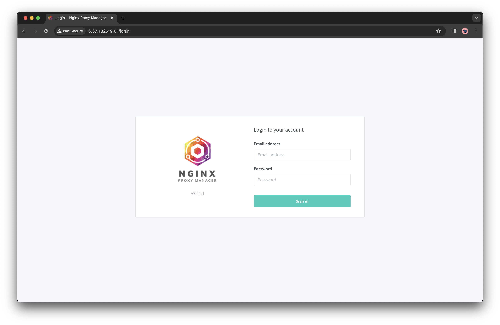
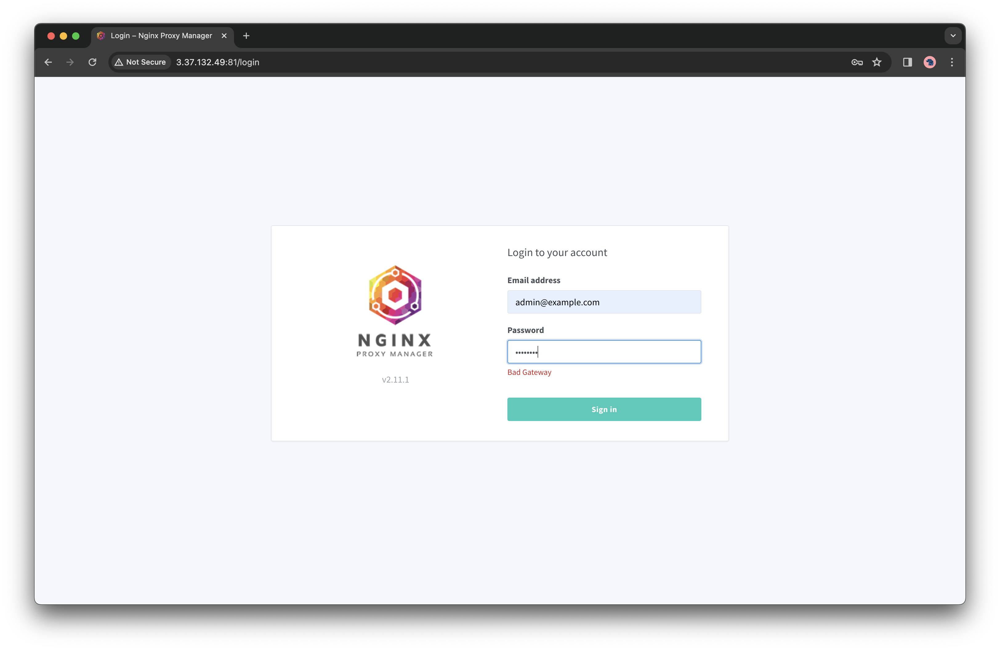
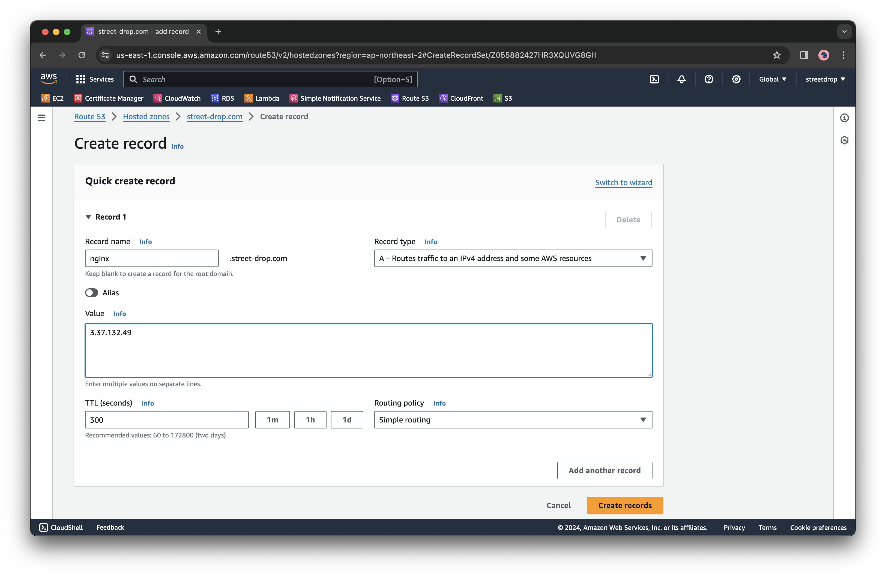
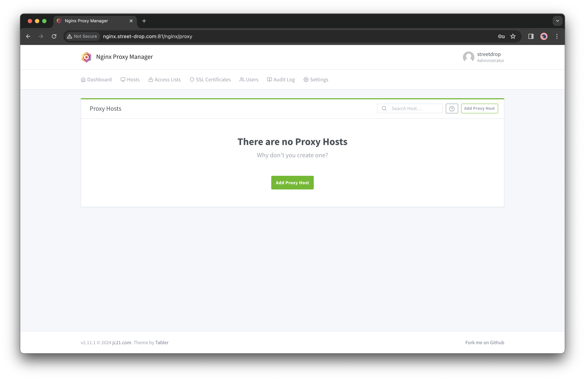
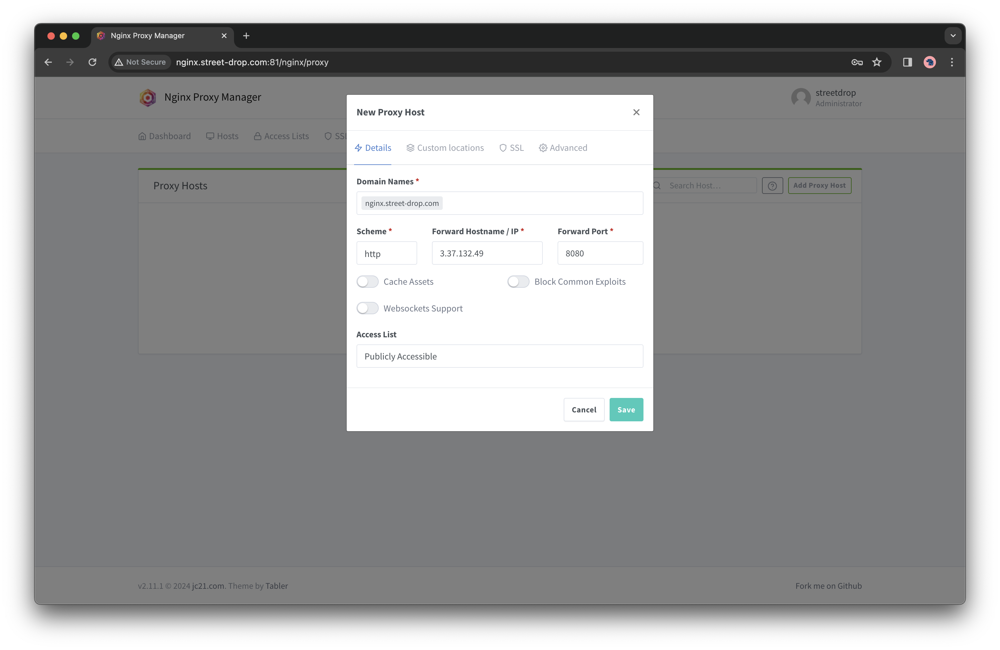
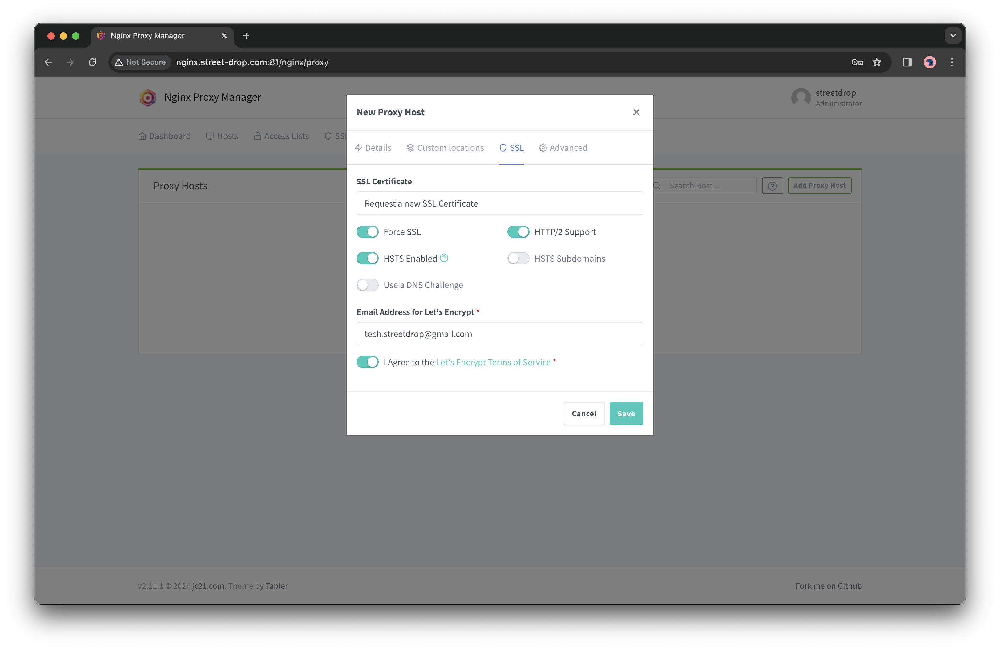
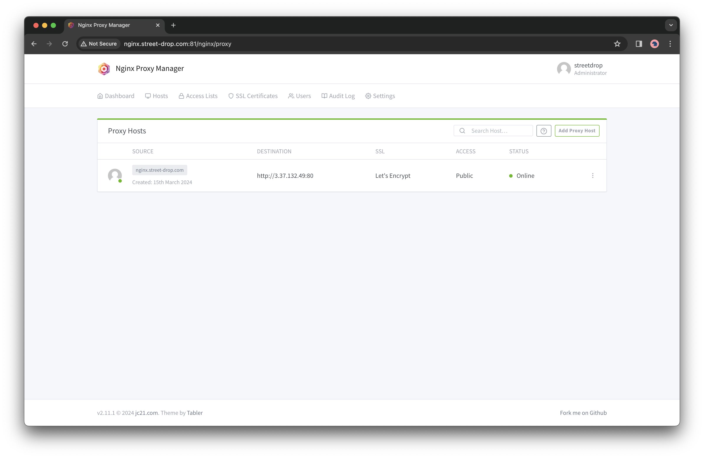
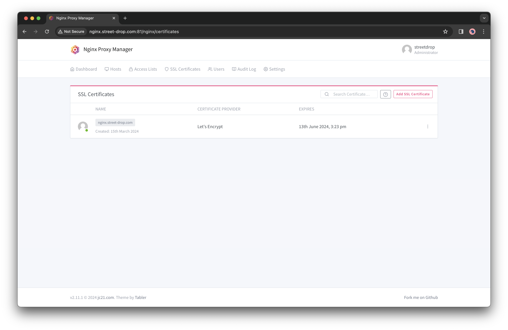
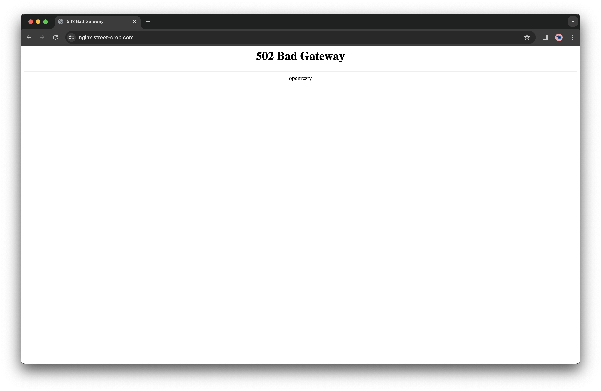
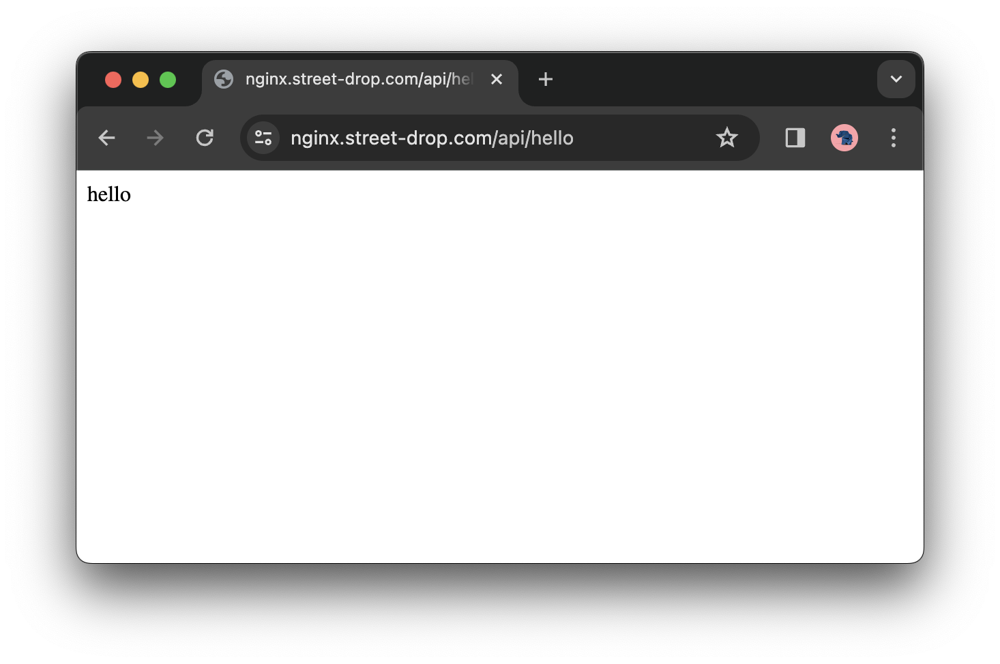

안녕하세요. 스트릿 드랍에서 백엔드 개발을 하고 있는 손시연 입니다.
이번 포스팅에서는 서버 배포 중 Nginx Proxy Manger를 사용했던 경험을 공유하려고 해요.

## 개요
SSL 보안을 적용하는 방법은 여러 가지가 있습니다.
- 웹 서버의 CLI를 사용하는 방법
	- 예: Nginx에서 SSL 인증서를 발급 받고 포트 포워딩하기
- AWS의 ELB(Elastic Load Balancer)를 사용하는 방법
	- 예: AWS Route53, ACM, ELB를 사용하기
- Nginx Proxy Manager 사용하는 방법

개인적인 경험을 바탕으로 느낀 장단점은 다음과 같았습니다.
- 웹 서버의 CLI를 사용하는 방법
	- 장점: 서버의 특정 요구 사항에 맞게 SSL 보안을 정교하게 구성할 수 있다
	- 단점: 초보자가 시도하기에는 초기 설정 및 유지 보수 과정에서 기술적인 지식이 필요했다
- AWS의 ELB를 사용하는 방법
	- 장점: AWS 콘솔을 통해 몇 번의 클릭만으로 쉽게 구성할 수 있다
	- 단점: AWS에 종속 되고, ELB는 사용량에 따라 요금이 부과된다

스트릿드랍은 두 번째 방법을 채택했습니다. 프로젝트가 확장되면서 EC2와 ELB에서 예상보다 큰 요금이 청구 되었고, AWS 비용 절감 방법을 고민하게 되었습니다. 그 방법 중 하나가 ELB를 사용하지 않고 SSL을 적용하는 것이었습니다.

Nginx의 경우 Let's Encrypt와 같은 인증 기관에서 SSL/TLS 인증서를 발급 받고, Nginx의 설정 파일을 CLI에서 직접 수정하여 HTTPS로 액세스할 수 있도록 설정할 수 있습니다. 그러나 CLI를 사용하여 설정하는 방법은 복잡해서 번거롭다고 느꼈습니다. 설정에 익숙해지면 좋겠지만, Nginx Proxy Manage(NPM)라는 좋은 선택지를 알게 되었고 새로운 기술을 도전해보기로 결정했습니다.


## Nginx Proxy Manager란?
nginx가 지원하는 프록시 기능을 편하게 사용할 수 있도록 도와주는 솔루션 입니다. nginx의 프록시 설정들을 추출하여 웹 기반 인터페이스 형태로 보여줍니다.
- 공식 문서: https://nginxproxymanager.com


## 설치 방법
> ip 주소와 도메인은 포스팅을 위해 임의로 생성한 것입니다.

1. **docker-compose로 컨테이너 생성하기**
```
    version: '3'
    services:
      db:
        image: 'jc21/mariadb-aria:latest'
        restart: always
        environment:
          MYSQL_ROOT_PASSWORD: 'abc123'
          MYSQL_DATABASE: 'npm'
          MYSQL_USER: 'abc'
          MYSQL_PASSWORD: '123'
        volumes:
          - /home/me/docker/npm/mysql:/var/lib/mysql
      app:
        depends_on:
          - db
        image: 'jc21/nginx-proxy-manager:latest'
        restart: always
        ports:
          - '80:80'
          - '81:81'
          - '443:443'
        environment:
          DB_MYSQL_HOST: "db"
          DB_MYSQL_PORT: 3306
          DB_MYSQL_USER: "abc"
          DB_MYSQL_PASSWORD: "123"
          DB_MYSQL_NAME: "npm"
        volumes:
          - /home/me/docker/npm/data:/data
          - /home/me/docker/npm/letsencrypt:/etc/letsencrypt
```


2. **접속 후 로그인**
- `http://{#ip}:81` 로 접근하면 NPM 로그인창이 뜹니다.
	- 혹시 AWS EC2에서 작업 중 로그인 창이 뜨지 않는다면 인스턴스 > 보안 > 인바운드 규칙에서 81번 포트 허용해 주시길 바랍니다.




- 로그인 시 디폴트 ID/PW는 다음과 같습니다.
	- Email: `admin@example.com`
	- Password: `changeme`


- 로그인 시 Bad Gateway 오류가 발생할 수도 있습니다.




- NPM이 사용하는 내장 MySQL의 권한 문제임을 파악했고, 다음과 같이 docker compose 스크립트를 수정했습니다.
- 관련 링크: https://github.com/NginxProxyManager/nginx-proxy-manager/issues/2774

- 기존
```
version: '3'
services:
  app:
	image: 'jc21/nginx-proxy-manager:latest'
	ports:
	  - '80:80'
	  - '81:81'
	  - '443:443'
	environment:
	  DB_MYSQL_HOST: "db"
	  DB_MYSQL_PORT: 3306
	  DB_MYSQL_USER: "npm"
	  DB_MYSQL_PASSWORD: "npm"
	  DB_MYSQL_NAME: "npm"
	volumes:
	  - ./data:/data
	  - ./letsencrypt:/etc/letsencrypt
  db:
	image: 'jc21/mariadb-aria:latest'
	environment:
	  MYSQL_ROOT_PASSWORD: 'npm'
	  MYSQL_DATABASE: 'npm'
	  MYSQL_USER: 'npm'
	  MYSQL_PASSWORD: 'npm'
	volumes:
	  - ./data/mysql:/var/lib/mysql
```
    
- 수정
```
version: '3'
services:
  db:
	image: 'jc21/mariadb-aria:latest'
	restart: always
	environment:
	  MYSQL_ROOT_PASSWORD: 'abc123'
	  MYSQL_DATABASE: 'npm'
	  MYSQL_USER: 'abc'
	  MYSQL_PASSWORD: '123'
	volumes:
	  - /home/me/docker/npm/mysql:/var/lib/mysql
  app:
	depends_on:
	  - db
	image: 'jc21/nginx-proxy-manager:latest'
	restart: always
	ports:
	  - '80:80'
	  - '81:81'
	  - '443:443'
	environment:
	  DB_MYSQL_HOST: "db"
	  DB_MYSQL_PORT: 3306
	  DB_MYSQL_USER: "abc"
	  DB_MYSQL_PASSWORD: "123"
	  DB_MYSQL_NAME: "npm"
	volumes:
	  - /home/me/docker/npm/data:/data
	  - /home/me/docker/npm/letsencrypt:/etc/letsencrypt
```


3. **DNS 등록**
- A 레코드로 서버의 IP 주소 등록합니다. 스트릿드랍의 도메인 서비스는 AWS의 Route53을 사용했습니다.



- 이제 DNS 주소로도 접근할 수 있습니다.


4. **Proxy Hosts 생성하기**
- `Add Proxy Hosts` : Proxy Host와 SSL 인증서를 생성합니다.



- 스프링부트 서버로 연결하기 위해 8080 포트를 포트 포워딩 해줍니다.



- SSL 인증서도 추가합니다.



- Proxy Host가 등록되었습니다.



- SSL 인증서도 자동으로 등록되었습니다.



- HTTPS 적용 후 502 Bad Gateway 문제가 발생할 수 있습니다. 인스턴스 > 보안 > 인바운드 규칙에서 포트 포워딩 하고 싶은 포트를 열어주시길 주시길 바랍니다.


- 이제 HTTPS로 접속할 수 있습니다.



## 후기
Nginx의 설정들을 웹 인터페이스 형태로 모아둔 NPM은 굉장히 편리했습니다. 배포에 리소스를 줄일 수 있었기 때문입니다. 마치 Git CLI를 사용하다가, GUI Tool에서 편하게 사용하는 기분이었습니다. 웹 서버의 리버스 프록시와 같은 간단한 기능을 하기에는 충분한 기술이라고 생각합니다.
Nginx 설정을 바로 읽는 게 아니라 별도의 SQLite DB를 동작시키기 때문에, 동기화가 느릴 수 있습니다. 또 Nginx의 설정을 직접 코드로 조작할 수 없어, 자유도는 떨어질 수 있습니다. 그러나 아직까지는 리버스 프록시 이상의 필요성을 못 느꼈고, 현재 NPM에서 제공하는 기능으로도 충분했습니다. 다시 또 NPM을 사용할 것이냐고 물어본다면 "YES!" 라고 말하고 싶습니다.