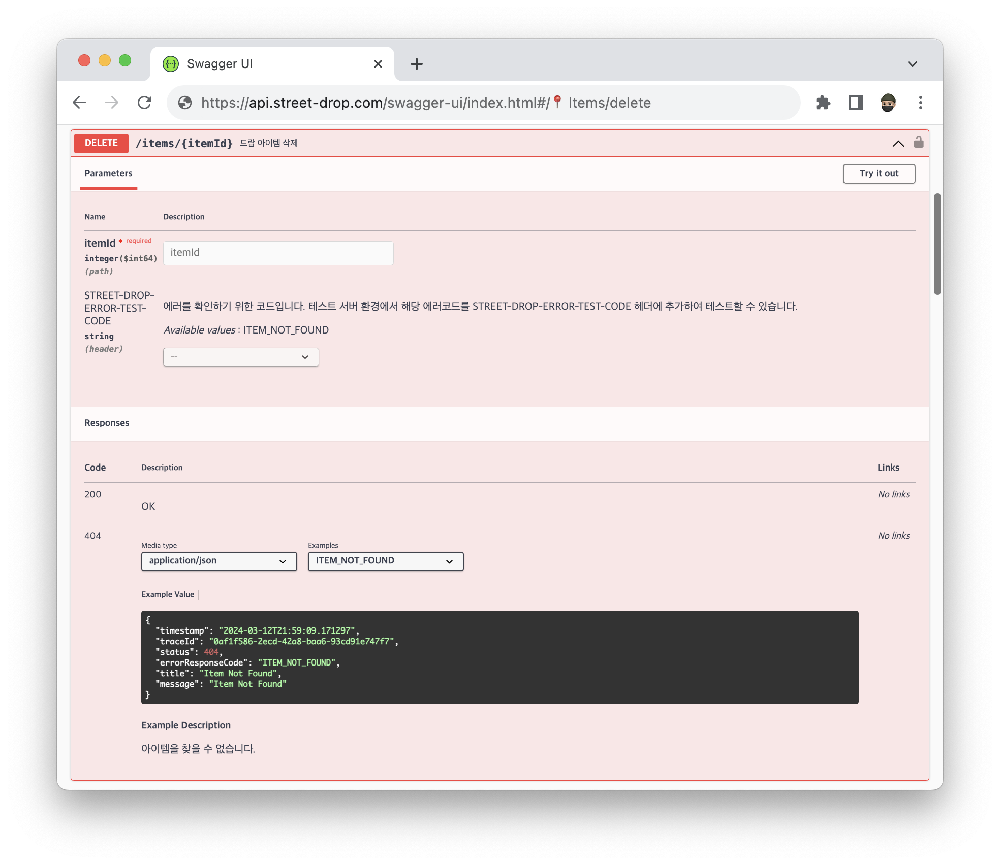
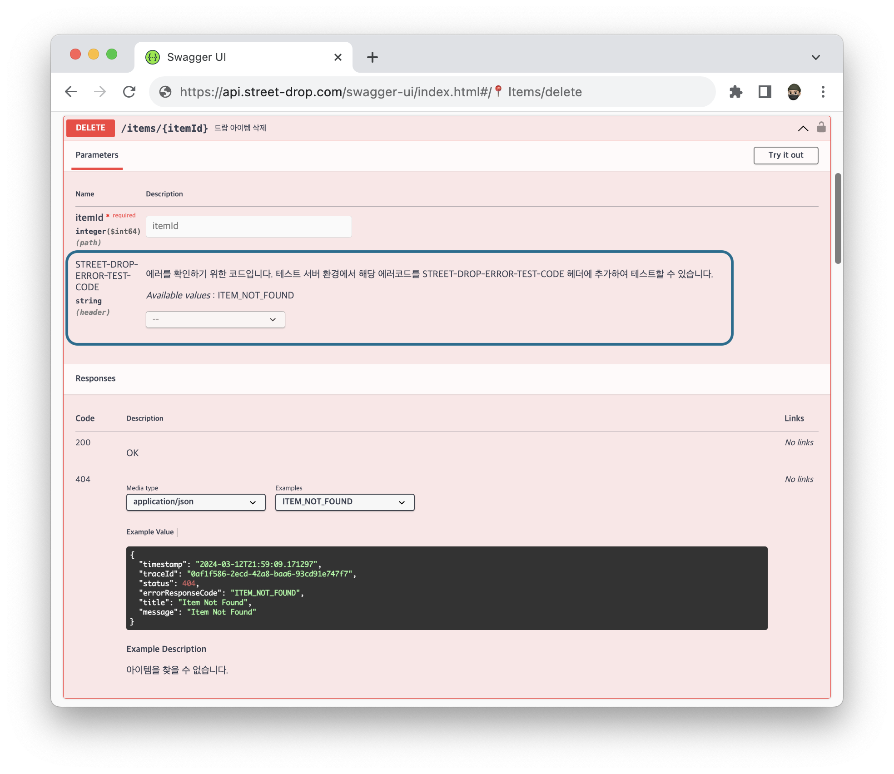
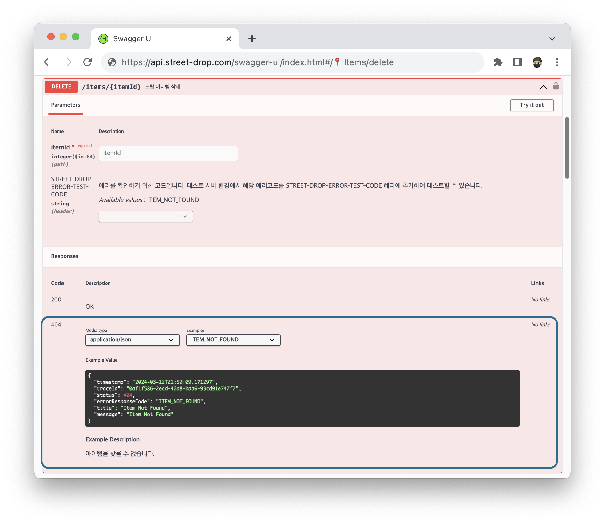

안녕하세요. 스트릿 드랍에서 백엔드 개발을 하고 있는 정성훈이라고 합니다.

이번 포스팅에서는 스트릿 드랍에서 테스트를 진행하면서, 스트릿 드랍에서 에러 시나리오 테스트를 간편하게 진행했던 방법 공유드리려고 합니다.

## 에러 시나리오 테스트

스트릿 드랍에서는 유닛 테스트 코드를 통해서, 특정 엔드포엔트에 대한 응답값을 검증하고 있습니다. 그러나, 유닛 테스트만으로는 실제 사용 환경에서 발생할 수 있는 모든 상황을 충분히 검증하기 어렵습니다. 따라서
사용자의 관점에서 애플리케이션의 전체적인 작동을 확인하는 것을 목적으로 하는 E2E 테스트가 필요합니다.
이를 통해 여러 API 통신간에서 또는 실제 유저가 어플을 사용하면서 발생할 수 있는 에러를 포착할 수 있습니다.

만약 5분전에 생성된 게시글이 현재는 삭제되어, 해당 게시글을 다시 조회할 경우 404 에러 페이지가 보이는 경우를 테스트 하기 위해서는 iOS에서는 아래와 같은 시나리오를 따라서 처리해야 합니다.

1. 새로운 게시글을 생성
2. 새롭게 작성된 특정 게시글을 삭제
3. 어플 기획상 id로 특정 게시글 조회가 어렵기 때문에, 게시글 리스트에서는 보이지만, 삭제된 게시글을 조회 함.
4. 404 에러 페이지가 명확히 나오는 지를 테스트

서비스의 기획에 따라서 특정 에러 시나리오가 매우 간헐적으로 발생해서 이런 에러가 발생했을 때 실제로 E2E 관점에서의 에러는 매우 테스트하기 어려울 수 있습니다. (특히, 스트릿 드랍은 지역 기반으로 작동하며,
새로운 게시글이 생성되기 위해서는 지역정보와 음악정보들이 필요했기 때문에 특정 시나리오 테스트를 위한 더미 데이터를 만들고 구성하는데에 있어서도 큰 어려움이 있었습니다.)

## 커스텀 헤더 추가하기

HTTP 헤더는 클라이언트와 서버가 요청 또는 응답으로 부가적인 정보를 전송할 수 있도록 해줍니다. 키와 값으로 구성되며 User-Agent, 언어정보, 미디어 타입에 대한 여러 정보를 주고 받을 수 있습니다.
개발자는 커스텀 헤더를 추가해서 부가적인 정보를 처리하는 것이 가능합니다.

2012년 이전에는 'X-' 라는 접두사를 붙이는 것이 권장되었으나 최신에서는 HTTP 스펙에서는 더 이상 해당 접두사를 사용하지 않고 있습니다.
개발자가 커스텀 헤더를 추가할때, 헤더의 목적을 쉽게 이용할 수 있도록 대시(-)를 기준으로 의미가 명확한 용어를 사용하며, 각 단어의 첫 글자를 대문자로 작성하는 것이 관례입니다. 하지만, Spring에서
Request 헤더 정보를 확인할 때, 대/소문자를 구분하지 않습니다.

스트릿 드랍에서는 "STREET-DROP-ERROR-TEST-CODE"라는 커스텀 헤더를 추가해서 에러 시나리오를 테스트하는데 활용하고 있습니다.

특정 ITEM이 삭제되어 더 이상 찾을 수 없을때, ITEM_NOT_FOUND 라는 에러코드가 발생한다고 하면, 해당 에러코드를 넣어서 API 에러를 테스트 할 수 있습니다.

``` 
STREET-DROP-ERROR-TEST-CODE : ITEM_NOT_FOUND
```

위의 시나리오와 같이 특정 1번 아이템이 삭제된 경우를 가졍하세 이를 테스트하려면, 다음과 같이 iOS에서 에러를 추가해서 요청하면 해당 요청에 따라 적합한 에러를 제공합니다. (테스트 서버에서만 활성화되어
실서버에서는 작동하지 않습니다.)

```bash
curl -X 'GET' \
  'https://api.street-drop.com/items/1' \
  -H 'STREET-DROP-ERROR-TEST-CODE: ITEM_NOT_FOUND'
```

제공된 에러 응답

```json
{
  "timestamp": "2024-03-16T14:42:49.978736",
  "traceId": "0af1f586-2ecd-42a8-baa6-93cd91e747f7",
  "status": 404,
  "errorResponseCode": "ITEM_NOT_FOUND",
  "title": "Item Not Found",
  "message": "Item was deleted or can not accessible"
}
```

이를 통해서 iOS에서는 특정 에러에 대한 시나리오나 에러 화면을 바로바로 테스트 할 수 있습니다.

## 스프링에서 커스텀 헤더를 통한 에러 테스트 구현
구현 로직은 대략 다음과 같습니다.
1. HTTP 요청 헤더에서 STREET-DROP-ERROR-TEST-CODE의 값을 가져옵니다.
2. 이 헤더의 값이 에러 코드에 정의되어 있는지 확인하고 정의되어 있으면 에러를 발생시키고, 없는 경우 기존 요청을 처리합니다.

### OncePerRequestFilter 사용하기

이를 구현하기 위해서 필터와 인터셉트를 고민해볼 수 있는데, 필터의 경우 Request와 Response를 조작할 수 있지만, 인터셉트는 이를 조작할 수 없기 때문에 필터를 사용하는 거이 적합합니다.


> [**[Spring] 필터(Filter) vs 인터셉터(Interceptor) 차이 및 용도**](https://mangkyu.tistory.com/173)
>
> [Spring은 공통적으로 여러 작업을 처리함으로써 중복된 코드를 제거할 수 있도록 많은 기능들을 지원하고 있다. 이번에는 그 중에서 필터(Filter) vs 인터셉터(Interceptor)의 차이에 대해 알아보고자 한다....](https://mangkyu.tistory.com/173)
>
> [https://mangkyu.tistory.com/173](https://mangkyu.tistory.com/173)


필터중에서는 Http Request 한번의 요청에 대해서 한 번만 실행하는 필터인 OncePerRequestFilter를 사용했습니다. OncePerRequestFilter 상속하여 구현하면서, doFilter 대신
doFilterInternal 메서드를 구현하면 됩니다.

```java

@Component
public class OncePerRequestFilterTestFilter extends OncePerRequestFilter {

    @Override
    protected void doFilterInternal(HttpServletRequest request, HttpServletResponse response, FilterChain filterChain) throws ServletException, IOException {
        // 필터에서 전처리
        filterChain.doFilter(request, response);
        // 필터에서 후처리
    }
}
```

### 커스텀 헤더를 통한 에러 던지기

먼저 기존에 에러코드들이 다음과 같이 정의되어 있다고 가정해보겠습니다. 아래는 발생할 수 있는 모든 에러들을 묶어둔 ErrorCode enum 입니다,

```java
public enum ErrorCode {
    BAD_REQUEST(HttpStatus.BAD_REQUEST, "COMMON_BAD_REQUEST", "Bad Request", "The request could not be understood."),
    ITEM_NOT_FOUND(HttpStatus.NOT_FOUND, "ITEM_NOT_FOUND", "Item Not Found", "Item was deleted or can not accessible");

    private HttpStatus status;
    private String errorResponseCode;
    private String title;
    private String message;

}
```

아래는 해당 에러코드에서 맞는 enum이 있는지 체크하는 코드입니다.

```java
public class ErrorCodeMapper {
    public static Optional<ErrorCode> findByErrorCode(String code) {
        for (ErrorCode errorCode : ErrorCode.values()) {
            if (errorCode.getCode().equals(code)) {
                return Optional.of(errorCode);
            }
        }
        return Optional.empty();
    }
}
```

우선 실서버에서 헤더를 통해서 에러를 던지게 되면, 악용되는 사례가 있을 수 있기 때문에 프로파일을 통해서 테스트 서버와, 로컬 환경에서만 테스트 하도록 프로필을 지정해줍니다.

```
@Profile({"dev", "local"})
```

스프링에서 들어온 헤더를 읽으려면 HttpServletRequest request에서 getHeader 메서드를 사용해서 요청으로 들어온 헤더를 읽을 수 있습니다.

```java
public interface HttpServletRequest extends ServletRequest {
    String getHeader(String var1);
}
```

우선 스프링에서 들어온 헤더값을 읽고, 이 헤더와 일치하는 enum 값이 있을 경우 에러를 던지고, 아닌 경우 필터를 그냥 지나치도록 개발하면 됩니다.

```java

@Profile({"dev", "local"})
@Component
@Slf4j
public class ErrorTestHeaderFilter extends OncePerRequestFilter {

    public static final String ERROR_TEST_HEADER = "STREET-DROP-ERROR-TEST-CODE";
    private final ObjectMapper objectMapper = new ObjectMapper().registerModule(new JavaTimeModule()).disable(SerializationFeature.WRITE_DATES_AS_TIMESTAMPS);

    @Override
    protected void doFilterInternal(HttpServletRequest request, @NotNull HttpServletResponse response, @NotNull FilterChain filterChain) throws ServletException, IOException {
        String errorTestHeader = request.getHeader(ERROR_TEST_HEADER);  // 헤더에서 STREET-DROP-ERROR-TEST-CODE에 대한 Value를 가져옴

        if (errorTestHeader != null) {
            Optional<ErrorCode> errorCode = ErrorCodeMapper.findByErrorCode(errorTestHeader); // enum에서 해당 에러코드에 일치하는 값이 있는지 찾음

            if (errorCode.isPresent()) { // 일치하는 에러코드의 값이 있을 경우
                throwErrorResponse(response, errorCode.get()); // 에러를 발생
                return;
            }
        }
        filterChain.doFilter(request, response);
    }

    private void throwErrorResponse(HttpServletResponse response, ErrorCode errorCode) throws IOException { // 에러를 발생시킬 경우
        response.setContentType(APPLICATION_JSON_VALUE);
        response.setStatus(errorCode.getStatus().value());

        ErrorResponseDto errorResponseDto = new ErrorResponseDto(errorCode); // 서버에서 정의된 에러를 발생시킬 경우의 스키마
        String errorResponseJson = objectMapper.writeValueAsString(errorResponseDto);

        response.getWriter().write(errorResponseJson);
    }

}
```

1. ```request.getHeader(ERROR_TEST_HEADER);``` 을 통해서 헤더에서 STREET-DROP-ERROR-TEST-CODE에 대한 Value를 가져옵니다.
2. ```ErrorCodeMapper.findByErrorCode(errorTestHeader);``` 를 통해서 맞는 에러 enum이 있는지 확인합니다.
3. 일치하는 에러코드가 있을 경우 ```throwErrorResponse``` 내장 메서드를 통해서 에러를 발생시킵니다.
4. ```throwErrorResponse``` 메서드에서는 HttpServletResponse에 ContentType과 상태코드, 에러코드를 에러응답 dto로 변환하고 Json으로 작성하여 response
   body에 추가합니다.

### 실제 스트릿 드랍 에러 테스트용 필터

아래는 스트릿 드랍에서 실제로 사용하는 에러 테스트용 필터입니다. 도메인 별로 에러코드를 묶어주었기 때문에, 제너릭을 일부 사용하였습니다.

```java

@Profile({"dev", "local"})
@Component
@Slf4j
public class ErrorTestHeaderFilter extends OncePerRequestFilter {

    public static final String ERROR_TEST_HEADER = "STREET-DROP-ERROR-TEST-CODE";
    private final ObjectMapper objectMapper = new ObjectMapper().registerModule(new JavaTimeModule()).disable(SerializationFeature.WRITE_DATES_AS_TIMESTAMPS);

    @Override
    protected void doFilterInternal(HttpServletRequest request, @NotNull HttpServletResponse response, @NotNull FilterChain filterChain) throws ServletException, IOException {
        String errorTestHeader = request.getHeader(ERROR_TEST_HEADER);

        if (errorTestHeader != null) {
            Optional<ErrorCode> errorCode = ErrorCodeMapper.findByErrorCode(errorTestHeader);

            if (errorCode.isPresent()) {
                throwErrorResponse(response, errorCode.get());
                return;
            }
        }
        filterChain.doFilter(request, response);
    }

    private <T extends ErrorCodeInterface> void throwErrorResponse(HttpServletResponse response, T errorCode) throws IOException {
        response.setContentType(APPLICATION_JSON_VALUE);
        response.setStatus(errorCode.getStatus().value());

        HttpErrorResponseDto httpErrorResponseDto = HttpErrorResponseDto.from(errorCode);
        String errorResponseJson = objectMapper.writeValueAsString(httpErrorResponseDto);

        response.getWriter().write(errorResponseJson);
    }

}
```

## 스웨거에서 에러코드 제공하기

스트릿 드랍은 Swagger를 통해서 API를 문서화 하고 있습니다. 위에서 에러 테스트 코드가 가능한 에러 코드를 제공할 때, 이를 스웨거에서 같이 제공하고자 했었습니다.



### SpringDoc - OperationCustomizer
SpringDoc 라이브러리를 활용하여 스웨거를 적용하고 있습니다. SpringDoc 에서는 OperationCustomizer 커스텀하여, 스웨거의 파라미터, 응답값을 수정할 수 있습니다.
CustomOperationCustomizer를 만들어 Swagger Config에 다음과 같이 추가할 수 있습니다

```java

@Component
@Slf4j
@AllArgsConstructor
public class CustomOperationCustomizer implements OperationCustomizer {
    @Override
    public Operation customize(Operation operation, HandlerMethod handlerMethod) {
    }
}
```

```java

@Configuration
@RequiredArgsConstructor
public class SwaggerConfig {

    private final OperationCustomizer operationCustomizer;

    @Bean
    public GroupedOpenApi publicApi() {
        return GroupedOpenApi.builder()
                .group("v1")
                .pathsToMatch("/**")
                .addOperationCustomizer(operationCustomizer)
                .build();
    }
}
```
### 커스텀 어노테이션 만들기  - ApiErrorResponse와 ApiErrorResponses

SpringDoc에서는 다음과 같이 ApiResponse 어노테이션을 통해서 응답코드와 설명을 작성할 수 있습니다.

```java
    @Operation(summary = "Reverse Geocoding")
    @ApiResponse(responseCode = "200", description = "좌표 주소 변환 성공")
    public ResponseEntity<ReverseGeocodeResponseDto> reverseGeocode() {
        
    }
```

Api 오류 코드의 경우 이를 응용하여 ApiErrorResponse와 ApiErrorResponses 어노테이션을 만들어 처리하고자 하였습니다. ApiErrorResponses의 경우 SpringDoc에서
ApiResponses로 어노테이션이 복수인 경우 감싸서 처리하고 있었기 때문에 유사하게 처리하고자 했습니다.

```java

@Target({ElementType.METHOD, ElementType.TYPE, ElementType.ANNOTATION_TYPE})
@Retention(RetentionPolicy.RUNTIME)
@Inherited
@Repeatable(ApiErrorResponses.class)
public @interface ApiErrorResponse {

    String description() default "";

    String errorCode() default "COMMON_INTERNAL_SERVER_ERROR";

}
```

```java

@Target({ElementType.METHOD, ElementType.TYPE, ElementType.ANNOTATION_TYPE})
@Retention(RetentionPolicy.RUNTIME)
@Inherited
public @interface ApiErrorResponses {

    ApiErrorResponse[] value() default {};

    Extension[] extensions() default {};

}
```

ApiErrorResponses는 아래와 같이 사용할 수 있습니다.

```java
    @Operation(summary = "아이템 신고하기")
    @ApiErrorResponses(value = {
            @ApiErrorResponse(errorCode = "ITEM_NOT_FOUND", description = "아이템을 찾을 수 없습니다."),
            @ApiErrorResponse(errorCode = "ITEM_ALREADY_ITEM_REPORTED_ERROR", description = "이미 신고한 아이템입니다.")
    })
    public ResponseEntity<Void> claimItem() {
    }
```

### 어노테이션값 가져와서 Swagger 수정하기

CustomOperationCustomizer의 customize에서 우선 해당 어노테이션 정보를 가져옵니다.
```java
    @Override
    public Operation customize(Operation operation, HandlerMethod handlerMethod) {
        ApiErrorResponse apiErrorResponseAnnotation = handlerMethod.getMethodAnnotation(ApiErrorResponse.class);
    
        if (apiErrorResponseAnnotation != null) {
            handleApiErrorResponse(operation, apiErrorResponseAnnotation);
        }
    
        return operation;
    }
```
handleApiErrorResponses는 handleApiErrorResponse와 큰 차이가 없기 때문에 handleApiErrorResponse를 우선으로 보면,
ErrorCodeMapper에서 맞는 에러 코드를 찾고 해당 하는 에러코드가 있으면 errorResponseExampleCustomizer와 errorRequestHeaderCustomizer를 통해 각각 에러 응답예제와 응답헤더 예제를 생성합니다.

```java
    private void handleApiErrorResponse(Operation operation, ApiErrorResponse apiErrorResponseAnnotation) {
        ErrorCodeMapper.findByErrorCode(apiErrorResponseAnnotation.errorCode())
                .ifPresent(errorCode -> {
                    var errorCodeExampleList = List.of(Map.of(errorCode, apiErrorResponseAnnotation.description()));
                    errorResponseExampleCustomizer.generateErrorResponseExample(operation, errorCodeExampleList);
                    errorRequestHeaderCustomizer.generateErrorRequestHeader(operation, errorCode);
                });
    }
```
ErrorRequestHeaderCustomizer는 아래 사진에서 보이는 파란 색 부분으르 만드는 객체입니다.


ErrorRequestHeaderCustomizer 에서는 Operation안의 Parameter 리스트의 값에 헤더를 추가합니다.
```java
@Component
public class ErrorRequestHeaderCustomizer {

    public void generateErrorRequestHeader(Operation operation, List<ErrorCode> errorCodeList) {
        var defaultParameters = getDefaultParameter(operation);
        var newErrorCodeParameters = generateErrorRequestHeader(errorCodeList);
        defaultParameters.add(newErrorCodeParameters);
        if (defaultParameters.size() == 1) {
            operation.setParameters(defaultParameters);
        }
    }

    public void generateErrorRequestHeader(Operation operation, ErrorCode errorCode) {
        var defaultParameters = getDefaultParameter(operation);
        var newErrorCodeParameters = generateErrorRequestHeader(singletonList(errorCode));
        defaultParameters.add(newErrorCodeParameters);
        if (defaultParameters.size() == 1) {
            operation.setParameters(defaultParameters);
        }
    }

    private List<Parameter> getDefaultParameter(Operation operation) {
        List<Parameter> parameters = operation.getParameters();
        if (parameters == null) {
            parameters = new ArrayList<>();
        }
        return parameters;
    }

    private Parameter generateErrorRequestHeader(List<ErrorCode> errorCode) {  // 에러 헤더 만들기
        var parameter = new Parameter();
        parameter.setName("STREET-DROP-ERROR-TEST-CODE");
        parameter.setIn("header");
        parameter.setDescription("에러를 확인하기 위한 코드입니다. 테스트 서버 환경에서 해당 에러코드를 STREET-DROP-ERROR-TEST-CODE 헤더에 추가하여 테스트할 수 있습니다.");
        parameter.setRequired(false);
        parameter.setDeprecated(false);
        parameter.setSchema(generateErrorRequestHeaderSchema(errorCode));
        return parameter;
    }

    private Schema<?> generateErrorRequestHeaderSchema(List<ErrorCode> errorCode) { // 에러 리스트를 Enum 형태로 선택할 수 있도록 하기
        var schema = new Schema<>();
        schema.setEnum(Arrays.asList(errorCode.stream().map(ErrorCode::getErrorResponseCode).toArray()));
        schema.setType("string");
        return schema;
    }
}
```
ErrorResponseExampleCustomizer 는 아래 사진에서 보이는 파란 색 부분인 응답 예제를 만드는 부분입니다. SpringDoc에서는 Example을 통해서 응답예제를 만들어내는데, 이를 수정하여 예외 스키마를 만들어 낼 수 있습니다.


ErrorResponseExampleCustomizer 에서는 Example을 변경하여 에러 예외 스키마 예시를 만들어냅니다.
```java
@Component
public class ErrorResponseExampleCustomizer {

    public void generateErrorResponseExample(Operation operation, List<Map<ErrorCode, String>> errorCodeExampleList) {
        ApiResponses responses = operation.getResponses();

        Map<Integer, List<Map<ErrorCode, String>>> errorCodeExampleByStatus = errorCodeExampleList.stream()
                .collect(groupingBy(errorCodeStringMap -> errorCodeStringMap.keySet().iterator().next().getStatus().value()));

        errorCodeExampleByStatus
                .forEach(
                        (statusCode, value) -> {
                            MediaType mediaType = new MediaType();
                            value.forEach(map ->
                                    map.forEach(
                                            (errorResponse, description) -> {
                                                Example example = generateExample(errorResponse, description);
                                                mediaType.addExamples(errorResponse.getErrorResponseCode(), example);
                                            }
                                    ));
                            Content content = generateContent(mediaType);
                            ApiResponse apiResponse = generateApiResponse(content);
                            responses.addApiResponse(statusCode.toString(), apiResponse);
                        });
    }

    private ApiResponse generateApiResponse(Content content) {
        ApiResponse apiResponse = new ApiResponse();
        apiResponse.setContent(content);
        return apiResponse;
    }

    private Content generateContent(MediaType mediaType) {
        Content content = new Content();
        content.addMediaType("application/json", mediaType);
        return content;
    }

    private Example generateExample(ErrorCode errorCode, String description) {
        Example example = new Example();
        HttpErrorResponseDto httpErrorResponseDto = HttpErrorResponseDto.from(errorCode);
        example.setValue(httpErrorResponseDto);
        example.setDescription(description);
        return example;
    }
}
```


아래는 ApiResponses도 함께 처리하는 CustomOperationCustomizer 전체 코드입니다. 

```java

@Component
@Slf4j
@AllArgsConstructor
public class CustomOperationCustomizer implements OperationCustomizer {

    private final ErrorRequestHeaderCustomizer errorRequestHeaderCustomizer;
    private final ErrorResponseExampleCustomizer errorResponseExampleCustomizer;

    @Override
    public Operation customize(Operation operation, HandlerMethod handlerMethod) {
        ApiErrorResponse apiErrorResponseAnnotation = handlerMethod.getMethodAnnotation(ApiErrorResponse.class);
        ApiErrorResponses apiErrorResponsesAnnotation = handlerMethod.getMethodAnnotation(ApiErrorResponses.class);

        if (apiErrorResponseAnnotation != null) {
            handleApiErrorResponse(operation, apiErrorResponseAnnotation);
        }

        if (apiErrorResponsesAnnotation != null) {
            handleApiErrorResponses(operation, apiErrorResponsesAnnotation);
        }

        return operation;
    }

    private void handleApiErrorResponse(Operation operation, ApiErrorResponse apiErrorResponseAnnotation) {
        ErrorCodeMapper.findByErrorCode(apiErrorResponseAnnotation.errorCode())
                .ifPresent(errorCode -> {
                    var errorCodeExampleList = List.of(Map.of(errorCode, apiErrorResponseAnnotation.description()));
                    errorResponseExampleCustomizer.generateErrorResponseExample(operation, errorCodeExampleList);
                    errorRequestHeaderCustomizer.generateErrorRequestHeader(operation, errorCode);
                });
    }

    private void handleApiErrorResponses(Operation operation, ApiErrorResponses apiErrorResponsesAnnotation) {
        List<Map<ErrorCode, String>> errorCodeExampleList = Arrays.stream(apiErrorResponsesAnnotation.value())
                .map(apiErrorResponse -> ErrorCodeMapper.findByErrorCode(apiErrorResponse.errorCode())
                        .map(code -> Map.of(code, apiErrorResponse.description()))
                        .orElse(emptyMap()))
                .filter(map -> !map.isEmpty())
                .toList();

        List<ErrorCode> resultList = errorCodeExampleList.stream().flatMap(map -> map.keySet().stream()).toList();

        errorRequestHeaderCustomizer.generateErrorRequestHeader(operation, resultList);
        errorResponseExampleCustomizer.generateErrorResponseExample(operation, errorCodeExampleList);
    }

}
```
## 결론
커스텀 헤더와 스웨거를 통한 에러 코드 문서화 작업을 통해서, 다양한 상황에서의 에러 시나리오를 iOS 측에서도 에러 화면에 대해서 빠르게 처리할 수 있었고, 이를 기존에 사용하던 Swagger를 통해서 문서화 하면서 에러 응답을 간단하게 Swagger에서 확인할 수 있었습니다.


## 참고


> [**HTTP 헤더로 에러 테스트하기**](https://velog.io/@tosspayments/HTTP-헤더로-에러-테스트하기-zuya4t6v)
>
> [토스페이먼츠 API를 사용해서 커스텀 HTTP 헤더로 다양한 에러 시나리오를 테스트하세요. 개발 과정에서 예상치 못한 문제를 미리 발견하고 대응할 수 있...](https://velog.io/@tosspayments/HTTP-헤더로-에러-테스트하기-zuya4t6v)
>
> [https://velog.io/@tosspayments/HTTP-헤더로-에러-테스트하기-zuya4t6v](https://velog.io/@tosspayments/HTTP-헤더로-에러-테스트하기-zuya4t6v)


>[**[스프링] spring swagger 같은 코드 여러 에러 응답 예시 만들기**](https://devnm.tistory.com/29)
> 
> 두둥 프로젝트에서는 처리중에 에러가 발생할경우 RuntimeException 을 상속받은 DuDoongException 에서 다시 상속받아서 코드별 에러클래스를…
> 
> [https://devnm.tistory.com/29](https://devnm.tistory.com/29)


> [**[Spring] 필터(Filter) vs 인터셉터(Interceptor) 차이 및 용도**](https://mangkyu.tistory.com/173)
>
> [Spring은 공통적으로 여러 작업을 처리함으로써 중복된 코드를 제거할 수 있도록 많은 기능들을 지원하고 있다. 이번에는 그 중에서 필터(Filter) vs 인터셉터(Interceptor)의 차이에 대해 알아보고자 한다....](https://mangkyu.tistory.com/173)
>
> [https://mangkyu.tistory.com/173](https://mangkyu.tistory.com/173)
