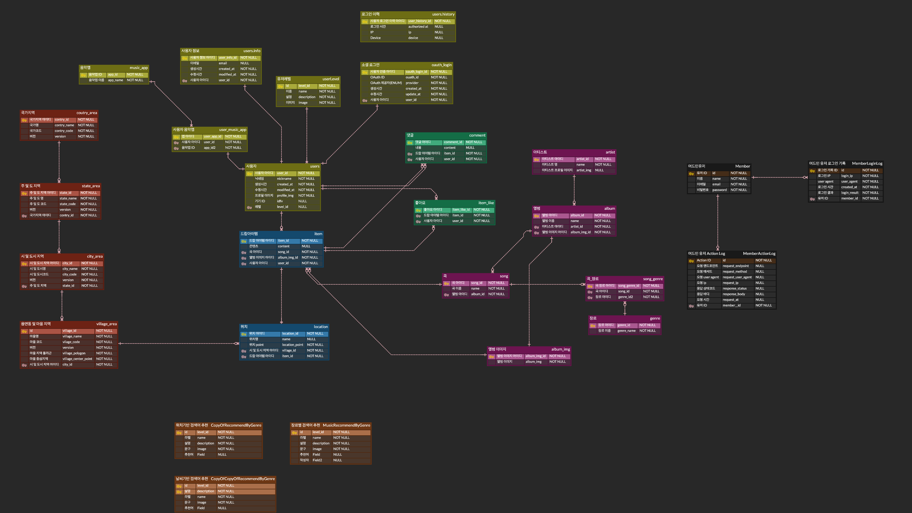

# Database Schema
스트릿드랍의 데이터베이스 스키마에 대한 항목 입니다.

> Database는 관계형 데이터베이스인 MySQL 8.0을 사용하였으며 자세한 설명은 ERD 다이어그램 밑에 첨부되어 있습니다.

## Schema 설계

### 문서화
Street Drop 서비스는 데이터베이스 스키마 설계에 ERD Cloud 툴을 사용하였습니다.

### 명명 규칙
1. Street Drop 서비스는 스키마 설계 시 테이블명과 필드명 등 일관성을 유지하는데 중점을 두었습니다.
2. 테이블 이름, 열 이름, 필드 등에 예약어를 사용하지 않도록 하였습니다.

### 테이블

| 테이블   |설명| 
|-------|---|
| Users |Street Drop 서비스를 사용하는 사용자에 대한 정보입니다. 유효한 디바이스 ID인 IDFV 값을 통해 사용자를 식별합니다.|

