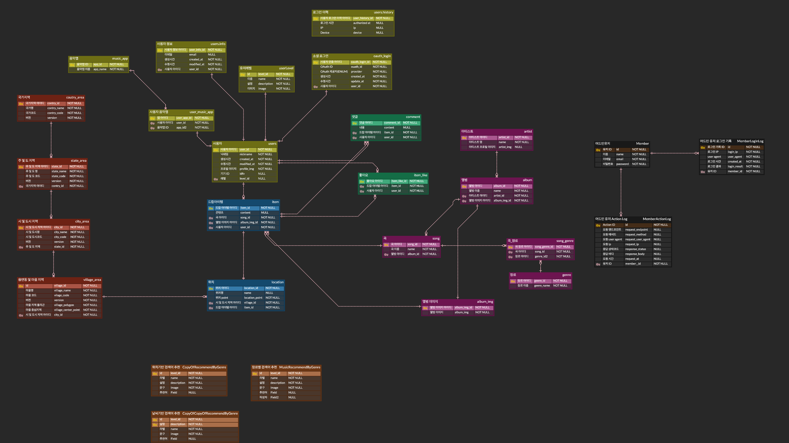
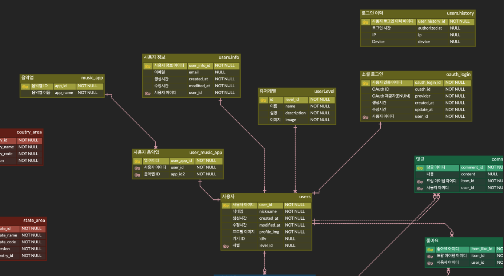
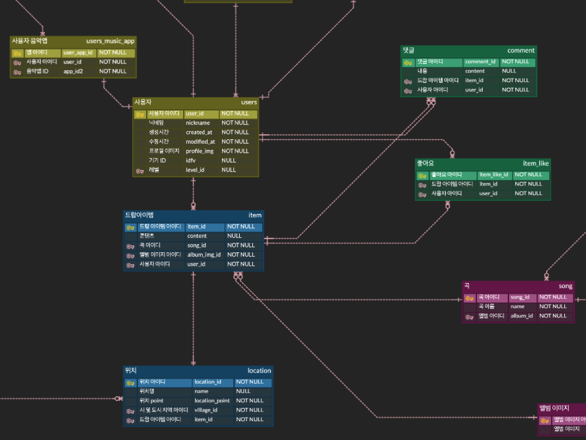
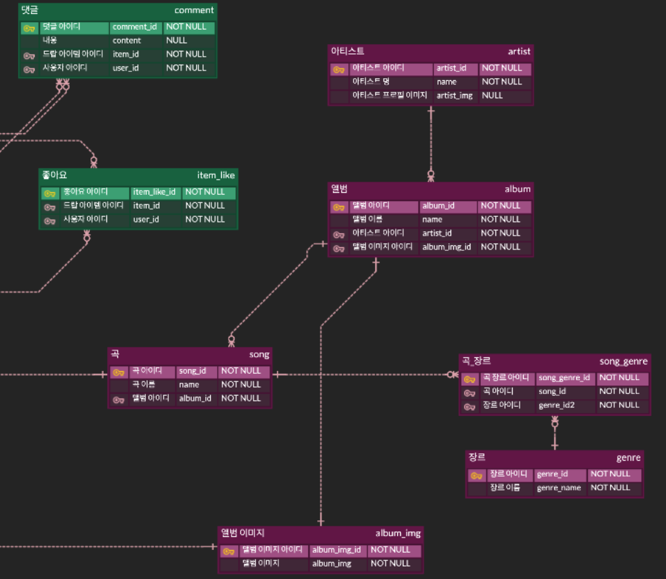
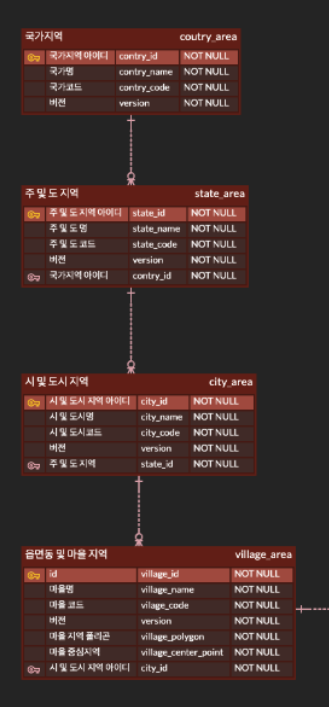
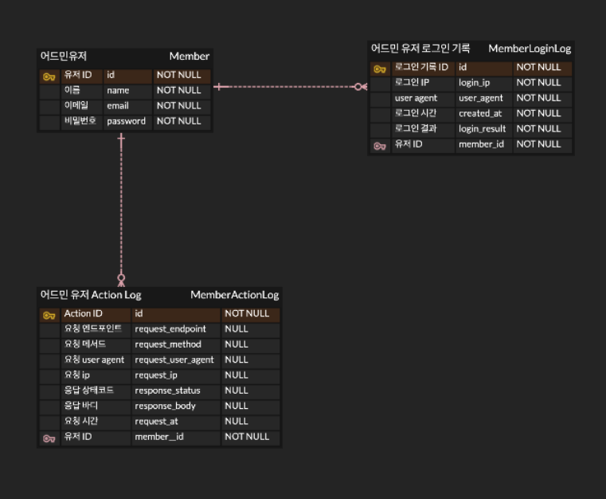

# Database Schema
스트릿 드랍(Street Drop) 서비스의 데이터베이스 스키마에 대한 문서 입니다.
> Database는 관계형 데이터베이스인 MySQL 8.0을 사용하였으며 자세한 설명은 ERD 다이어그램 밑에 첨부되어 있습니다.

### 문서화
- Street Drop 서비스는 데이터베이스 스키마 설계에 ERD Cloud Tool을 사용하였습니다.

### 명명 규칙
1. Street Drop 서비스는 스키마 설계 시 테이블명과 필드명 등 일관성을 유지하는데 중점을 두었습니다.
2. 테이블 이름, 열 이름, 필드 등에 예약어를 사용하지 않도록 하였습니다.

## Schema 설계
### 전체 ERD 다이어그램

### 사용자 관련 ERD 다이어그램

사용자 도메인에 대한 ERD 다이어그램 입니다. 

| 이름       | 엔티티       | 테이블 | 설명                                                                   |
|----------|-----------|---|----------------------------------------------------------------------|
| 사용자      | User      | users | 사용자에 대한 정보 입니다. 닉네임, 생성시간, 수정시간, 프로필 이미지, 디바이스 ID(idfv) 등의 필드가 있습니다. |
| 사용자 정보   | User Info | users_info | 사용자의 추가 정보를 담고 있습니다. 이메일 등의 필드가 있습니다.                                |
| 사용자 음악 앱 | User Music App | users_music_app | 사용자가 사용하는 음악 앱에 대한 정보를 담고 있습니다. ID, 사용자 아이디, 음악 앱 ID 필드가 있습니다.       |    
| 음악 앱 | Music App | music_app | 음악 앱에 대한 정보를 담고 있습니다. 음악 앱 ID, 음악 앱 이름 필드가 있습니다.                     |
| 사용자 레벨   | User Level | users_level | 사용자의 레벨에 대한 정보를 담고 있습니다. 레벨명, 레벨 설명, 레벨 이미지 필드가 있습니다.                |
| 사용자 인증   | OAuth Login | oauth_login | 소셜 로그인 연동 시 OAuth에서 제공하는 정보를 담고 있습니다. OAuth ID, OAuth 제공자 필드가 있습니다.  |
| 로그인 이력 | User History | users_history | 사용자의 로그인 이력을 담고 있습니다. 로그인 시간, 로그인 IP, 로그인 디바이스 필드가 있습니다.             |

### 드랍 아이템 관련 ERD 다이어그램

드랍 아이템 도메인에 대한 ERD 다이어그램 입니다.

| 이름        | 엔티티 | 테이블 | 설명                                                                         |
|-----------| --- | --- |----------------------------------------------------------------------------|
| 드랍 아이템    | Item | item | 드랍 아이템에 대한 정보를 담고 있습니다. 아이템 아이디, 콘텐츠, 곡 ID, 앨범 이미지 ID, 사용자 ID 필드가 있습니다.    |
| 드랍 아이템 위치 | Item Location | item_location | 드랍 아이템의 위치에 대한 정보를 담고 있습니다. 위치명, 위치 Point, Village ID, 드랍 아이템 ID 필드가 있습니다. |
| 드랍 아이템 댓글 | Item Comment | item_comment | 드랍 아이템에 달린 댓글에 대한 정보를 담고 있습니다. 댓글 ID, 댓글 내용, 드랍 아이템 ID, 사용자 ID 필드가 있습니다. |
| 드랍 아이템 좋아요 | Item Like | item_like | 드랍 아이템에 대한 좋아요에 대한 정보를 담고 있습니다. 좋아요 ID, 드랍 아이템 ID, 사용자 ID 필드가 있습니다. |

### 음악 관련 ERD 다이어그램

음악 도메인에 대한 ERD 다이어그램 입니다.

| 이름 | 엔티티 | 테이블 | 설명                                                            |
| --- | --- | --- |---------------------------------------------------------------|
| 아티스트 | Artist | artist | 아티스트에 대한 정보를 담고 있습니다. 아티스트 ID, 아티스트 명, 아티스트 프로필 이미지 필드가 있습니다. |
| 앨범 | Album | album | 앨범에 대한 정보를 담고 있습니다. 앨범 ID, 앨범 명, 아티스트 ID, 앨범 이미지 ID 필드가 있습니다. |
| 앨범 이미지 | Album Image | album_image | 앨범 이미지에 대한 정보를 담고 있습니다. 앨범 이미지 ID, 앨범 이미지 필드가 있습니다. |
| 곡 | Song | song | 곡에 대한 정보를 담고 있습니다. 곡 ID, 곡 명, 앨범 ID 필드가 있습니다. |
| 곡 장르 | Song Genre | song_genre | 곡 장르에 대한 정보를 담고 있습니다. 곡 장르 ID, 곡 ID, 장르 ID 필드가 있습니다. |
| 장르 | Genre | genre | 장르에 대한 정보를 담고 있습니다. 장르 ID, 장르 명 필드가 있습니다. |

### 지역 관련 ERD 다이어그램

지역 도메인에 대한 ERD 다이어그램 입니다.

| 이름 | 엔티티 | 테이블 | 설명                                                                                         |
| --- | --- | --- |--------------------------------------------------------------------------------------------|
| 국가 지역 | Country Area | country_area | 국가 지역에 대한 정보를 담고 있습니다. 국가 지역 ID, 국가명, 국가코드, 버전 필드가 있습니다.                                   |
| 주 및 도 지역 | State Area | state_area | 주 및 도 지역에 대한 정보를 담고 있습니다. 주 지역 ID, 주 및 도 명, 주 및 도 코드, 버전, 국가 지역 ID 필드가 있습니다.               |
| 시 및 도시 지역 | City Area | city_area | 시 및 도시 지역에 대한 정보를 담고 있습니다. 도시 지역 ID, 시 및 도시명, 시 및 도시 코드, 버전, 도 지역 ID 필드가 있습니다.             |
| 읍면동 및 마을 지역 | Village Area | village_area | 읍면동 및 마을 지역에 대한 정보를 담고 있습니다.  마을 지역 ID, 마을 명, 마을 코드, 버전, 마을 지역 폴리곤, 마을 중심지역, 도시지역 ID 필드가 있습니다. |

### 관리자 관련 ERD 다이어그램

관리자 도메인에 대한 ERD 다이어그램 입니다.

| 이름 | 엔티티              | 테이블 | 설명                                                                                                 |
| --- |------------------| --- |----------------------------------------------------------------------------------------------------|
| 관리자 | Member           | member | 관리자에 대한 정보를 담고 있습니다. 관리자 ID, 관리자 이름, 이메일, 비밀번호 필드가 있습니다.                                           |
| 관리자 로그인 기록 | Member Login Log | member_login_log | 로그인 기록 ID, 로그인 IP, 로그인 시간, 사용자 에이전트, 로그인 결과, 사용자 ID 필드가 있습니다.                                      |
| 관리자 Action Log | Member Action Log | member_action_log | 관리자 Action Log ID, 관리자 ID, 요청 엔드포인트, 요청 메서드, 요청 사용자 Agent,, 요청 IP, 응답 상태코드, 응답 바디, 요청 시간 필드가 있습니다. |
