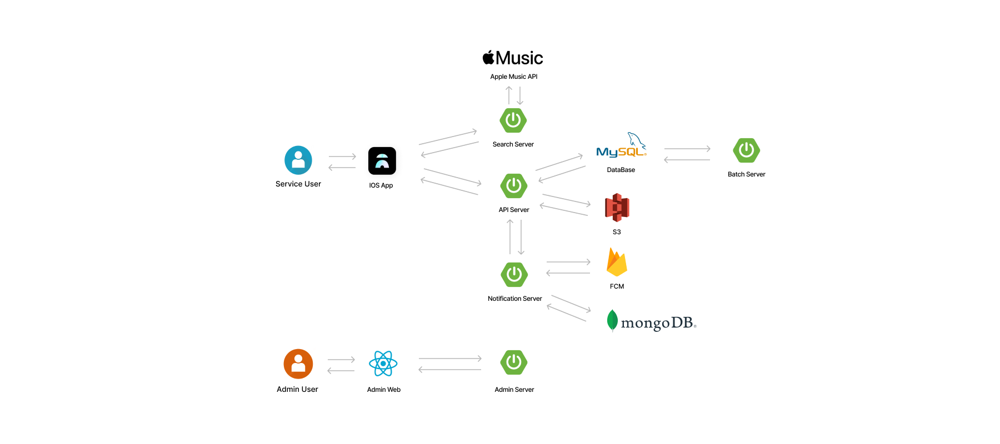

# 2	전체 설명
Street Drop은 **위치 기반 음악 공유 소셜 서비스**로서, 사용자들이 음악을 공유하고 다른 사용자들과 상호작용할 수 있는 플랫폼을 제공합니다. 현재 대한민국 내에서 사용 가능하며, 추후에 해외로 서비스를 제공할 예정입니다. 애플리케이션은 **iOS 디바이스 중 아이폰만을 지원**하며, 안드로이드 개발 인력의 부재로 인하여 안드로이드 기기는 2025년까지 서비스가 제공되지 않을 예정입니다.

## 2.1	제품 조망

### 2.1.1 시스템 개요
Street Drop은 위치 기반 음악 공유 소셜 서비스로서, 사용자 위치 근처의 음악을 공유하고, 다른 사용자들과 상호작용할 수 있는 플랫폼을 제공합니다. 사용자는 음악을 검색하고, 드랍하며, 다른 사용자들과 소통할 수 있습니다. 또한 사용자는 자신의 프로필을 통해 자신이 드랍한 음악과 좋아요한 음악을 관리할 수 있습니다. 이 서비스는 사용자들이 즐거운 음악 경험을 공유하고, 서로 소통할 수 있는 플랫폼을 제공합니다.



### 2.1.2 주요 구성 요소

1. **IOS App**: 사용자가 서비스를 사용하기 위한 IOS 애플리케이션입니다.

2. **서버**: 웹 프론트엔드와 데이터베이스 간의 통신을 관리하며, 비즈니스 로직을 수행합니다.

3. **데이터 베이스**: 사용자 정보, 콘텐츠 정보 등을 저장하고 관리합니다.

4. **푸시 서버**: 사용자에게 푸시 알림을 발송합니다.

5. **배치 서버**: 서비스의 콘텐츠를 관리하기 위한 배치 작업을 수행합니다. 
   
6. **검색 서버**: 사용자가 음악을 검색할 수 있도록 검색 기능을 제공합니다.

7. **웹 어드민 및 대시보드**: 내부 관리자가 서비스의 콘텐츠를 관리하고, 서비스의 상태를 모니터링할 수 있습니다.


### 2.1.3 외부 인터페이스

#### Client 외부 인터페이스 
1. **Naver Map Sdk** : 사용자의 위치 정보를 지도에 표시하기 위해서 Naver Map Sdk와 연결됩니다.

2. **FCM 푸시**: 사용자에게 푸시 알림을 발송하기 위해 Firebase Cloud Messaging (FCM) 서비스와 연결됩니다.

#### Server 외부 인터페이스

1. **음악 검색 API**: 사용자가 음악을 검색하기 위해 외부 음악 검색 API와 연결됩니다.

2. **FCM 푸시**: 사용자에게 푸시 알림을 발송하기 위해 Firebase Cloud Messaging (FCM) 서비스와 연결됩니다.

3. **AWS S3**: 사용자가 업로드한 콘텐츠를 저장하기 위해 Amazon Web Services (AWS) S3와 연결됩니다.


### 2.1.4 제품의 위치

- **서버**: 클라우드 호스팅 서비스 또는 데이터 센터에서 운영되며, 사용자들과의 통신 및 데이터 저장을 담당합니다.

- **IOS App**: 앱 스토어에서 다운로드 및 설치할 수 있는 IOS 기기 중 아이폰에서 실행됩니다.

- **웹 어드민 및 대시보드**: 내부 관리자가 접근하고 서비스의 콘텐츠를 관리하며, 어드민 패널 또는 웹 인터페이스를 통해 접근합니다.

### 2.1.5 비즈니스 프로세스 통합

- **음악 검색 및 공유**: 사용자는 음악을 검색하고 다른 사용자와 공유할 수 있으며, 서비스는 외부 음악 검색 API와 통합하여 검색 결과를 제공합니다.

- **푸시 알림**: 사용자에게 푸시 알림을 발송하여 새로운 음악 드랍 또는 상호작용을 알립니다.

- **콘텐츠 관리**: 관리자는 웹 어드민 및 대시보드를 통해 서비스의 콘텐츠를 관리하고 모니터링합니다.


### 2.1.6 제품의 제한사항

1. **인터넷 연결**: 사용자 및 관리자는 인터넷에 연결되어야 서비스를 사용할 수 있습니다.

2. **호환성**: android 기기는 지원하지 않으며, IOS 기기 중 아이폰만을 지원합니다.


## 2.2	전체 시스템 구성
### 2.2.1 하드웨어 구성
서비스는 클라우드 데이터 센터에서 운영되며, 사용자들과의 통신 및 데이터 저장을 담당합니다.

### 2.2.2 소프트웨어 구성

시스템의 소프트웨어 구성은 다음과 같습니다:
- **IOS 애플리케이션**: IOS 애플리케이션은 사용자들이 ios 디바이스에서 서비스를 이용할 수 있도록 합니다.
- **서버**: 서버는 웹 프론트엔드와 데이터베이스 간의 통신을 관리하며, 비즈니스 로직을 수행합니다.
- **데이터 베이스**: 데이터 베이스는 사용자 정보, 콘텐츠 정보 등을 저장하고 관리합니다.
- **알림 서버**: 알림 서버는 사용자에게 푸시 알림을 발송합니다.
- **배치 서버**: 배치 서버는 서비스의 콘텐츠를 관리하기 위한 배치 작업을 수행합니다.
- **검색 서버**: 검색 서버는 사용자가 음악을 검색할 수 있도록 검색 기능을 제공합니다.
- **웹 어드민 및 대시보드**: 웹 어드민 및 대시보드는 내부 관리자가 서비스의 콘텐츠를 관리하고, 서비스의 상태를 모니터링할 수 있습니다.

### 2.2.3 네트워크 구성

- 서비스는 HTTPS 프로토콜을 사용하여 암호화된 통신을 제공하며, SSL/TLS 인증서를 통해 보안을 강화합니다.
- 웹 서버와 데이터베이스 서버 간의 통신은 가상 사설 네트워크(VPC)를 통해 안전하게 이루어집니다.
- 관리자 인증은 로그인 시스템을 통해 이루어집니다.
- 서버간 내부 통신은 Https 프로토콜 또는 Message Queue를 사용하여 비동기 통신을 할 수 있습니다.

### 2.2.4 데이터베이스 구성

- **MySQL 데이터베이스**: MySQL 데이터베이스는 사용자 정보, 콘텐츠 정보 등을 관리합니다.

- **MongoDB 데이터베이스**: MongoDB 데이터베이스는 푸시 알림 정보를 관리합니다. 알림 서버는 MongoDB 데이터베이스를 통해 푸시 알림을 발송하고 발송결과를 기록합니다.

### 2.2.5 서버 구성
- **API 서버**: API 서버는 사용자들이 서비스를 이용할 수 있도록 API를 제공합니다. API 서버는 음악 드랍, 음악 좋아요, 음악 코멘트, 사용자 프로필, 사용자 히스토리등의 기능을 제공합니다.
- **검색 서버**: 검색 서버는 사용자가 음악을 검색할 수 있도록 검색 기능을 제공합니다.
- **알림 서버**: 알림 서버는 푸시 알림을 발송하고 발송 결과를 기록합니다.
- **어드민 서버**: 어드민 서버는 내부 관리자가 서비스의 콘텐츠를 관리하고 모니터링할 수 있도록 웹 어드민 및 대시보드를 제공합니다.
- **배치 서버**: 배치 서버는 서비스의 콘텐츠를 관리하기 위한 배치 작업을 수행합니다. 배치 서버는 유저 레벨 업데이트, 푸시 예약발송등의 기능을 제공합니다.


## 2.3	전체 동작방식

## 2.4	제품 주요 기능
Street Drop은 ***위치 기반 음악 공유 소셜 서비스를 제공하기 위한 기능***과 ***관리자들이 서비스를 관리할 수 있는 기능***을 모두 제공합니다.

서비스의 상세한 기능과 화면을 확인하기 위해서는 아래 서비스 소개 페이지를 통해서 확인해보실 수 있습니다.


### 서비스 기능

#### 홈 & 음악

- 홈에서는 지도 위에 드랍된 음악들을 확인 할 수 있습니다. 다른 유저들이 드랍한 음악을 들으며 해당 장소에 어울리는 노래를 들어볼 수 있습니다.

- 홈 하단에 있는 다이얼을 돌리며 원하는 음악과 재밌는 코멘트를 읽을 수 있습니다. 음악에 대한 간단한 정보와 함께 남겨진 코멘트를 확인할 수 있습니다.

- 현재 위치에서 500m 이내에 드랍된 음악들을 확인할 수 있습니다. 지도를 드래그하거나, 핀치를 통해 확대/축소를 할 수 있습니다.


#### 검색 & 드랍

- 드랍하기 위해서 음악명 또는 가수명을 검색하여 원하는 음악을 찾을 수 있습니다. 사용자의 위치 정보나 날씨 정보를 토대로 추천 검색어도 큐레이션을 제공합니다.

- 드랍시에는 40자 이내로 코멘트와 함께 음악을 공유할 수 있습니다. 드랍하기 버튼을 누르면 음표가 드랍되고, 다른 유저들도 지도 위에 드랍된 음악을 바로 확인할 수 있습니다.

#### 커뮤니티 & 푸시알림
- 다른 유저들이 드랍한 음악을 바로 듣기로 들을 수 있습니다. 좋아요를 눌러 공감 표현을 하면서 즐겁게 소통할 수 있습니다.

- 서비스 이용 정보를 바탕으로 장소 또는 음악을 추천하는 푸시 알림을 제공합니다. 개인별 푸시, 전체 푸시, 관심사 푸시등의 다양한 푸시 알림을 제공합니다.

#### 마이페이지 & 설정
- 마이페이지에서는 드랍과 좋아요 히스토리를 모아보고 관리할 수 있습니다. 현재 레벨을 귀여운 캐릭터와 함께 확인하고, 닉네임 수정과 서비스 관련 설정이 가능합니다.

- 설정에서는 유튜브 뮤직와 스포티파이 등 원하는 스트리밍 서비스로 연결하거나 푸시 알림 세팅등을 할 수 있습니다.

### 서비스 관리 기능

#### 로그인 기능
- 관리자 로그인을 통해서 주어진 권한을 가진 관리자만이 서비스 관리 기능을 이용할 수 있습니다.

#### 사용자 관리 기능
- 사용자 관리 기능에서는 유저의 정보를 확인하고, 사용자의 계정을 관리할 수 있습니다. 사용자의 계정을 삭제하거나, 사용자의 정보를 수정할 수 있습니다.
- 유저의 최근 활동 내역과 최근 드랍한 음악을 확인 할 수 있으며, 주 활동지역 및 관심 장르 정보등을 제공합니다.

#### 유저 통계 기능
- 유저 통계 기능에서는 유저 가입 그래프, 유저 활동 히스토리등을 제공합니다. 유저의 활동 히스토리를 바탕으로 유저의 행동 패턴을 분석할 수 있습니다.

#### 지역 통계 기능
- 지역별로 드랍된 음악의 통계를 제공합니다. 지역별로 드랍된 음악의 통계를 바탕으로 지역별 트렌드를 파악할 수 있습니다.

#### 컨텐츠 관리 기능
- 컨텐츠 관리 기능에서는 음악 및 코멘트 컨텐츠를 수정 및 삭제할 수 있습니다.
- 추가적으로 음악 검색 및 지도 기능을 함께 제공하고 있어, 추가 컨텐츠 생산이 가능합니다.

#### 알림 발송 및 관리 기능
- 알림 발송 및 관리 기능에서는 푸시 알림을 발송하고, 발송된 알림을 관리할 수 있습니다.
- 원하는 유저에게 개별 푸시 알림을 발송할 수 있으며, 푸시 알림을 발송한 히스토리를 확인할 수 있습니다.
- 전체 유저나 특정 유저 그룹에 대해서도 푸시 알림을 발송할 수 있습니다.

## 2.5	사용자 계층과 특징

사용자 계층은 크게 2부류로 **어플리케이션을 사용하는 서비스 사용자, 서비스를 운영하기 위한 관리자**로 나뉘어집니다.

### 어플리케이션을 사용하는 서비스 사용자
- 대부분의 사용자는 일반적인 유저로, 어플리케이션을 사용하여 서비스를 이용하는 사람들을 의미합니다. 이들은 어플리케이션을 통해 서비스의 주요 기능을 이용하며, 주로 음악 검색, 음악 드랍, 주변 음악 조회 등 다양한 활동을 수행합니다.

- 사용자들은 Iphone을 통해서 어플리케이션을 이용하게 되므로 각 디바이스에 화면 크게에 맞추어 최적화 해야합니다.

- 사용자들은 로그인을 하지 않아도 서비스를 이용할 수 있습니다. **익명성을 보장하고, 서비스 초기 진입 장벽을 낮추어 사용자들이 쉽게 서비스를 이용할 수 있도록 합니다.**

### 서비스를 운영하기 위한 관리자
- 스트릿 드랍은 운영하기 위한 서비스를 의미하며 스트릿 드랍 내부 개발자, 디자이너들을 위한 서비스가 제공됩니다. (Admin, 분석 정보 제공)

- 내부에서도 권한에 따라 제공되는 서비스가 나뉘어집니다.

    - **사용자 관리(내부 전인원)**: 관리자는 사용자 관리, 비즈니스 로직 설정 등을 수행할 수 있습니다. 서비스 운영에 주요한 역할을 합니다.

    - **서비스 컨텐츠 관리(내부 전인원)** : 관리자는 서비스에 제공되는 컨텐츠를 관리할 수 있습니다. 이는 음악, 댓글, 사용자 정보 등을 포함합니다.

    - **시스템 관리 및 모니터링(백엔드 개발자)**: 관리자는 어플리케이션과 서비스의 시스템을 관리하고 모니터링해야 합니다. 이는 서버 관리, 데이터베이스 관리, 네트워크 모니터링 등을 포함합니다.

    - **데이터 분석 및 보고(백엔드 개발자)**: 데이터 분석을 통해서, 서비스의 사용자들의 행동을 분석하고, 이를 바탕으로 서비스를 개선할 수 있습니다.


## 2.6	가정과 종속 관계
- 본 프로젝트는 **디프만 13기 프로젝트로 진행되었으며, 2023년 3월부터 시작하여, 2023년 7월내로 공개베타 서비스를 운영해야 합니다.**

- 앱스토어 심사가 필수적이므로, 앱스토어 심사 정책을 숙지하고 5일 정도 심사에 걸릴 것을 고려하여 개발해야 합니다.

- 프로덕션 서버의 경우, 클라우드 서비스의 이용을 가정합니다. 테스트 서버등은 홈서버를 통해서도 운영할 수 있습니다.


## 2.7	단계별 요구사항

### MAJOR 1.X.X 단계별 요구사항
MAJOR 1.X.X 단계에서는 프로젝트 MVP 검증을 위해서, 알파, 베타 버전으로 나누어 요구사항을 구분합니다.
**요구사항의 우선순위는 MVP 검증을 기준으로 부여합니다.** 베타 버전은 마이너 업데이트를 통해서 제공될 예정입니다.

#### 현재 버전 (알파 버전) 요구사항
- 기기 고유 ID를 통해서 사용자를 식별합니다. (사용자는 로그인을 하지 않아도 서비스를 이용할 수 있습니다.)
- 사용자는 음악을 검색하고 코멘트를 남겨 공유할 수 있습니다.
- 사용자는 자신이 드랍한 음악을 수정하거나 삭제할 수 있습니다.
- 사용자는 지도 위에 드랍된 음악을 확인할 수 있습니다.
- 사용자는 음악을 듣고, 좋아요를 누를 수 있습니다.
- 사용자는 좋아요한 음악을 확인하며 드랍(공유)한 음악을 확인할 수 있습니다.
- 사용자는 자신의 프로필을 확인하고, 닉네임을 수정할 수 있습니다.
- 사용자는 푸시를 통해서, 새로운 음악 드랍 또는 상호작용을 알림을 받을 수 있습니다.
- 레벨 시스템을 통해서 특정시간마다 사용자의 레벨을 업데이트 할 수 있습니다.
- 사용자는 스트리밍 서비스를 선택할 수 있습니다.
- 관리자는 사용자의 정보를 조회하고, 사용자가 드랍한 음악을 확인할 수 있습니다.
- 관리자는 사용자가 드랍한 음악을 삭제할 수 있습니다.
- 관리자는 유저의 가입 그래프, 활동 히스토리를 확인할 수 있습니다.
- 관리자는 로그인을 통해서 어드민과 대시보드에 접근할 수 있습니다.
- 관리자는 음악 및 코멘트 컨텐츠를 수정 및 삭제할 수 있습니다.
- 관리자는 지도화면에서 음악을 드랍할 수 있습니다.
- 관리자는 푸시 알림을 발송하고, 발송된 알림을 관리할 수 있습니다.

#### 미래 버전 (베타 버전) 요구사항
- 사용자는 개별 추천에 맞는 맞춤형 푸시 알림을 받을 수 있습니다.
- 사용자는 자신이 드랍한 음악을 지도화면에서 확인할 수 있어야 합니다.
- 사용자는 댓글 기능을 통해서, 다른 사용자와 소통할 수 있습니다.
- 다른 사용자 프로필을 확인할 수 있습니다.


## 2.8	하위 호환성
- 신규버전이므로 하위 호환성은 고려하지 않습니다.
- 서비스만 버전관리를 지원할 예정이고, 내부 관리 시스템의 경우 관리 인력부족으로 인해서 버전 관리를 지원하지 않을 예정입니다.
- **MAJOR 버전 업데이트 이후 하위 호환성을 위해서 이전 MAJOR 버전의 API을 3개월간 제공합니다.** 3개월이후에는 IOS 강제 업데이트를 통해서 하위 호환성을 제공하지 않습니다.
- 버전 관리는 아래와 같이 진행됩니다.
    ```
    MAJOR.MINOR.PATCH
    3.2.17
    ```

  1. **MAJOR 버전 업데이트**
      1. 기존 API 또는 기존 디자인 수정의 경우 바뀌면 "MAJOR" (주) 버전을 올립니다.
      2. 3개월에 최소한 한번의 Major 업데이트

  2. **MINOR 버전 업데이트**
      1. 기존 버전과 호환되면서 새로운 기능을 추가할 때(디자인 추가, API 추가)는 "MINOR" (부) 버전을 올립니다.
      2. 1개월에 최소한 한번의 MINOR 업데이트
     
  3. **PATCH 버전 업데이트**
      1. 기존 버전과 호환되면서 버그를 수정한 것이라면 "PATCH" (수) 버전을 올립니다.

